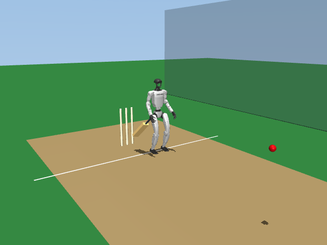
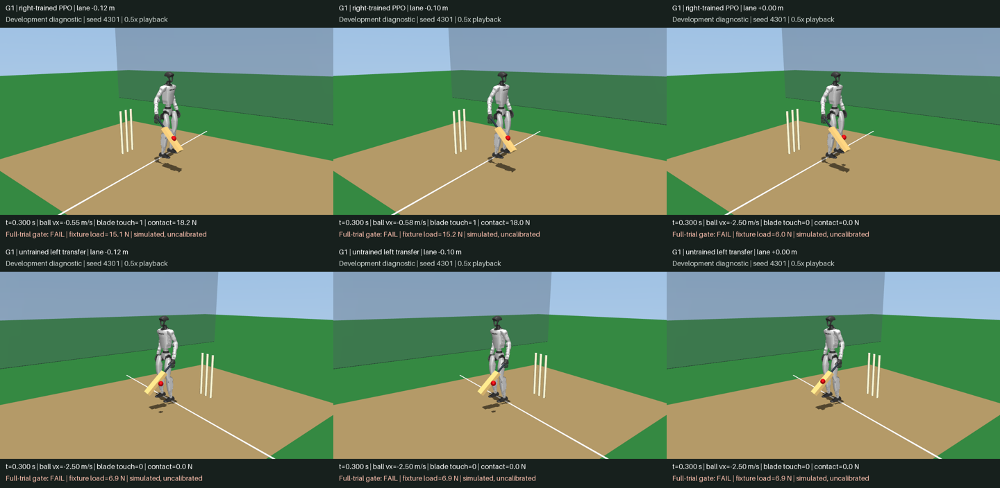
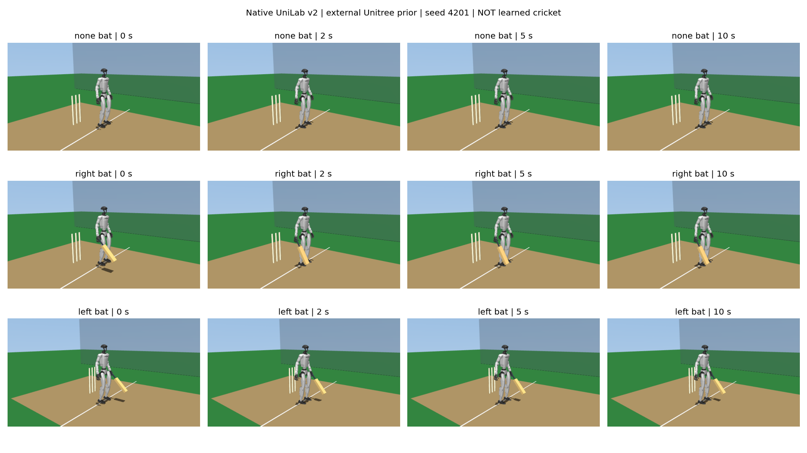

# Native G1 cricket foundation

## Current Direction: Whole-Body Cricket Motion

The [two-hand whole-body task](docs/g1_cricket_bimanual_tracking.md) supersedes
the isolated-arm direction for the requested G1 showcase. It retargets the
earlier batting choreography to G1's original proportions and controls all 29
joints, with separate right/left PPO actors on native mjbatch. Two mechanical
grips retain the bat; neither finger grasping nor completed batting is claimed.
The [balance-feedback revision](docs/g1_cricket_balance_feedback.md) completes
both reference-only swings, but bat-path accuracy and learned control remain
under development. Running bowling must similarly
learn the approach, gather, legal plant, release and recovery rather than rely
on the slow walking prior used in the historical experiments below.

The [two-hand soft-toss video](g1_cricket_results/bimanual_soft_toss_v1/two_hand_ppo_soft_toss.mp4)
now records actual simulated strikes and complete upright recovery with both
frozen PPO actors. The [full contact study](docs/g1_cricket_bimanual_contact.md)
retains both controls, both hands and both physics resolutions: all 16 episodes
complete, all eight tosses contact, no joint-stop or unexpected-contact failures.
This is not learned interception: the actors have no ball observation, and the
reference controller also hits. Bat-path accuracy and one reference pitch-force
agreement check remain failed. Running bowling and the final showcase are pending.

## Historical Single-Wrist Foundation

This experimental task uses UniLab's floating-base, 29-DoF Unitree G1 model
with its original joint limits, inertias and motor force limits. A 0.70 kg bat
is rigidly mounted to the selected wrist: this is a declared mechanical
fixture, not a dexterous grasp. A 0.156 kg, 36 mm-radius free ball, pitch,
creases, wickets and visual practice-net background are added at construction.
The source robot XML and existing demonstrations are unchanged.

**Development limitation:** historical checkpoints use a bat/ball model that
permits about 28 mm penetration. The opt-in impact-v1 correction reduces this to
5.65 mm in frozen-policy trials, but still fails the complete timestep comparison.
Fresh corrected-contact PPO also produces no valid shots in its full two-resolution
evaluation. Neither model is calibrated to physical cricket impacts.



The current geometry is a **practice drill**, not a regulation-match pitch:
visual practice lines are at x=0 and x=18 m, the retained wicket is at x=-0.6 m,
and the incoming ball starts at x=2.5 m. Regulation wicket separation, delivery
length and no-ball/crease semantics remain unverified. The robot stands 0.30 m
to the side of the ball/wicket line instead of on the stumps.

`G1CricketBatting` uses the native Manager-Based environment and CPU MuJoCo
backend. `task=g1_cricket_batting/mujoco` selects its owner configuration;
`env.handedness=left` selects the mirrored wrist fixture and lateral stance.
All 29 actions are joint-position target offsets. Initial standing pose and
incoming ball velocity are reset conditions; no robot root/joint pose is
overwritten during a policy step. The incoming ball is a bowling-machine
curriculum, not learned bowling.

## Experimental Native mjbatch Execution

`task=g1_cricket_tanh_v1/mjbatch` runs the same task through the companion
fork's native `Batch.step()` executor. Only the executor changes: materialized
robot/scene, 0.70 kg wrist fixture, prior, PPO observations, tanh residuals, reward
and physical gates are unchanged. This is not the legacy mjbatch example's
1.12 kg fixture or its different reset/training curriculum.

The [fixed-model contract](docs/g1_cricket_mjbatch_v1.md) and
[ADR-0011](docs/sphinx/source/adr/ADR-0011-experimental-mjbatch-recorder.md)
describe interval warmstart, solved-phase contact sensors and float32 endpoints.
State resets and external wrenches are supported; reset-time model mutation is
rejected. Any MuJoCo warning aborts the interval rather than accepting a
finite-looking state after solver auto-reset. The default executor is unchanged.
This first recorder makes no speedup claim.

Install the optional companion fork in the existing UniLab runtime, without
upgrading its pinned dependencies:

```sh
uv pip install --no-deps \
  'git+https://github.com/kishanpb/mjbatch.git@84431fea2bd0e86640968d8f06e975322747e5d9'
```

The 16 native G1 trajectory cases cover both hands, both timesteps, two lanes,
and zero/sinusoidal raw actions through actual termination. Every substep state
and sensor, policy observation, action target, reward and separation latch matches
the default engine exactly. Partial resets and applied-wrench tests also pass.
The [complete frozen-policy evaluation](g1_cricket_results/native_mjbatch_v1/evaluation.json)
now reproduces **all 192 rows exactly**: 96 identities at each of 0.25 and
0.125 ms, both hands, zero residual/PPO, three lanes and eight seeds. Every
executed interval also matches independent serial replay at its state/sensor
endpoint. Returns, force/contact evidence and every failure remain unchanged.
The [preflight](g1_cricket_results/native_mjbatch_v1/preflight.json) pins current
sources, the parent checkpoint/report and the companion recorder, Batch wrapper
and native binary; the completed report verifies 56 source/input hashes.

Right PPO still contacts 24/24 balls but has **0/24 qualified forward shots**
at each timestep. Left PPO remains untrained transfer and misses all 24.
This is verified native execution of a retained checkpoint, not fresh mjbatch
training, improved impact convergence, physical calibration or a showcase-ready
policy. Both-hand learning, bowling and new videos remain unfinished.

### Bounded Reversal Diagnostic

The [fixed search contract](docs/g1_cricket_reachability_v1.md) and
[complete report](g1_cricket_results/reachability_v1/evaluation.json) retain
161 scripted prefixes: zero plus 128 arm-sign vectors and 32 declared timing
refinements. This is one right-handed seed/center toss, not training or a
tournament. Eight complete zero-action baselines first reproduced both hands,
timesteps and executors exactly. Of 62 prefix-safe nonzero motions, only
`pmppppp_s10` exceeded 1 m/s and qualified for full replay.

Both executors produced identical full two-second outcomes:

| Physics step | First exit vx | Maximum penetration | Complete shot gate |
| --- | ---: | ---: | --- |
| 0.25 ms | 1.028620 m/s | 5.953697 mm | Pass |
| 0.125 ms | 1.066471 m/s | 6.620823 mm | Fail: above 6 mm |

No forbidden contacts, falls or joint-limit violations occurred in those four
full replays. The timestep comparison nevertheless fails penetration agreement
and gate consistency: **zero validated witnesses**. Fine-step simulated blade
force peaks at 273.684 N; fixture force/torque peaks are 99.198 N / 28.911 Nm.
The first loaded bat contact point moves forward at 1.263 m/s, and its first
impact delivers 0.556369 N s of positive-x ball impulse. These are uncalibrated
simulation diagnostics, not hardware loads or learned batting results.

All 161 prefix `passed` fields remain false; their shortened horizon cannot
establish a full shot. Missing separation by 0.50 s excludes a schedule from
full replay, so later outcomes for those schedules remain unknown. The report
checks 62 source/input hashes and native executor hashes; 70 focused tests pass.
The result motivates a bounded motion refinement with margin below the overlap
limit before more PPO training. It does not relax that limit or authorize a
learned-policy showcase, and the previous videos remain unchanged.

### Terminal Command Attenuation

The [frozen contract](docs/g1_cricket_terminal_residual_v1.md) and
[complete report](g1_cricket_results/terminal_residual_v1/evaluation.json) test
six scales for only tick 19 of `pmppppp_s10`: 0, 0.25, 0.5, 0.75, 0.875 and 1.
All other commands, physics parameters, rewards and gates are unchanged. Each
scale receives the full two-second trial at both timesteps and in both engines:
24 rows, with no adaptive selection or shortened-horizon claims.

| Tick-19 scale | Coarse exit vx | Coarse penetration | Fine exit vx | Fine penetration |
| --- | ---: | ---: | ---: | ---: |
| 1 | 1.028620 m/s | 5.953697 mm | 1.066471 m/s | 6.620823 mm |
| 0.875 | 1.018909 m/s | 5.931236 mm | 1.056453 m/s | 6.596869 mm |
| 0.75 | 1.009034 m/s | 5.911940 mm | 1.046252 m/s | 6.575707 mm |
| 0.5 | 0.988094 m/s | 5.867714 mm | 1.024786 m/s | 6.527888 mm |
| 0.25 | 0.966415 m/s | 5.819693 mm | 1.003344 m/s | 6.476335 mm |
| 0 | 0.997288 m/s | 6.628370 mm | 0.986107 m/s | 6.422581 mm |

The two executors match exactly for all 12 pairs, including first-impact
evidence; all four scale-1 baselines reproduce the parent. All rows finish by
native truncation with zero replay error. Six individual coarse rows pass, but
**zero scales qualify across all four contexts**: every fine trial exceeds
6 mm. Scale 0 passes the numerical timestep comparison but fails the physical
shot gates; the other five fail penetration agreement and gate consistency.

All 67 source/input hashes were verified, and 45 focused tests pass (including
12 new tests). No policy was trained or promoted, and these simulated forces
remain uncalibrated. This closes only the tested attenuation family, not the
possibility of G1 batting. A separately bounded pre-contact face-orientation
study is a better next hypothesis than more tiny late-command adjustments:
the retained parent impact normal has a vertical component that adds to normal
closing speed. The wrist-only test below probes that hypothesis; no showcase
is ready.

### Wrist Pitch And Motor Saturation

The [fixed wrist-pitch experiment](docs/g1_cricket_wrist_pitch_v1.md) changes only
channel 5 during ticks 10-19 of the same parent motion. Seven scales receive
complete two-second trials at both timesteps in both engines. The
[28-row report](g1_cricket_results/wrist_pitch_v1/evaluation.json) retains all
outcomes and first-contact direction diagnostics; all 14 executor pairs and
four unchanged-parent baselines match exactly, with zero replay error.

| Pitch scale | Coarse exit vx | Coarse penetration | Fine exit vx | Fine penetration |
| --- | ---: | ---: | ---: | ---: |
| 1, 0.75, 0.5, 0 (each) | 1.028620 m/s | 5.953697 mm | 1.066471 m/s | 6.620823 mm |
| -0.5 | 1.033778 m/s | 6.047993 mm | 1.065627 m/s | 6.605200 mm |
| -0.75 | 1.025395 m/s | 5.893790 mm | 1.056031 m/s | 6.427966 mm |
| -1 | 1.059571 m/s | 6.486581 mm | 1.064644 m/s | 6.568480 mm |

Ten individual coarse rows pass; **zero scales qualify across all contexts**.
All 18 failing rows fail only penetration. The intended contact-orientation
change was barely achieved: at the fine step, scale -1 changes first-contact
normal z from 0.271933 to 0.270656, and its vertical closing-speed contribution
from -1.071596 to -1.066727 m/s. Contact normals are not necessarily blade-face
normals, and command targets are not achieved joint angles.

A separate [motor audit](g1_cricket_results/wrist_pitch_v1/wrist_saturation.json)
replays scales 1 and 0 in native mjbatch at both timesteps, requiring each full
result to equal its retained row. It reconstructs requested affine PD torque
from matched solve-phase actuator caches and compares every applied sample
with the unchanged +/-5 N m wrist-pitch limit. Across these four complete
trials, 48,000 physics solves are checked and summarized in 400 control ticks.
Reconstruction error is at most 1.78e-15 N m overall and zero during the forward
phase. During ticks 10-19, **every solve is saturated at -5 N m**:
800/800 per coarse trial and 1,600/1,600 per fine trial.
Fine-step requested torque spans -50.302 to -12.176 N m for scale 1 and
-44.602 to -6.476 N m for scale 0. Both commands therefore produce the same
applied torque throughout that phase; the different targets do not establish
a meaningful change in contact orientation.

The sweep verifies 72 source/input hashes; the additional audit verifies 75.
There are 57 passing focused tests, including nine new command/direction tests
and three new torque-audit tests. Reproduce the additional audit with the same
runtime via `python scripts/audit_g1_cricket_wrist_saturation.py` under `uv run`.
No motor limit, gain, contact model, reward or prior was changed. These are
uncalibrated simulation diagnostics, not new learning or a showcase. Further
motion search should account for the weak wrist through proximal-arm motion,
not infer wrist controllability from target changes or increase hardware limits.

### Elbow Motion With Motor Telemetry

The [fixed elbow contract](docs/g1_cricket_elbow_v1.md) changes only channel 3
during ticks 10-19, testing four scales in both executors at both timesteps.
The [complete report](g1_cricket_results/elbow_v1/evaluation.json) retains all
16 full two-second trials. The four parent baselines and all eight executor
pairs match exactly, including impact evidence and achieved motor traces.

| Elbow scale | Coarse exit vx | Coarse penetration | Fine exit vx | Fine penetration |
| --- | ---: | ---: | ---: | ---: |
| 1 | 1.028620 m/s | 5.953697 mm | 1.066471 m/s | 6.620823 mm |
| 0.75 | 1.010858 m/s | 6.497762 mm | 0.999878 m/s | 6.298167 mm |
| 0.5 | 0.964222 m/s | 6.023618 mm | 0.977664 m/s | 6.254677 mm |
| 0 | 0.910326 m/s | 5.805542 mm | 0.947774 m/s | 6.465175 mm |

Only the two coarse parent rows pass; **zero scales qualify across contexts**.
Scale 0.5 passes the numerical comparison but fails the physical shot gates.
There are no new contacts/limits/stability failures: attenuation trades away
speed without bringing fine-step penetration below 6 mm.

The elbow actually responds. At the fine timestep, its forward-phase minimum
angle moves from 0.959749 rad at scale 1 to 1.118130 rad at scale 0. The parent
saturates negatively for only 4/1,600 forward-phase solves; all three attenuated
candidates have zero saturated solves in that phase. The first-contact normal
z increases from 0.271933 to 0.290913, while its vertical closing-speed
contribution becomes more negative (-1.071596 to -1.150823 m/s). Thus the
reset-time orientation intuition did not predict a beneficial coupled impact.
This is not the earlier wrist saturation plateau or a proof that batting is
impossible.

The collector verifies named direct-joint transmission and unit gear before
reporting joint angle, angular velocity and torque. It checks applied torque
against the unchanged +/-25 N m elbow limit at all 192,000 physics solves,
retaining 1,600 control-interval summaries. Maximum reconstruction error is
7.11e-15 N m; state/sensor replay errors are zero. All 81 source/input hashes
verify, and 68 focused tests pass, including 11 new command/motor-trace tests.
No policy, motor, reward, contact or prior change was made.

Further small joint-target sweeps are not supported by these results. The
isolated model study below follows this control diagnosis; the current robot
task remains unchanged, uncalibrated and without a new showcase.

With the documented external prior and runtime installed, the focused verification is:

```sh
uv run --no-sync python -m pytest tests/envs/test_g1_cricket_mjbatch.py \
  tests/scripts/test_g1_cricket_mjbatch_report.py tests/base/test_mujoco_substeps.py -q
```

The [evaluation runner](scripts/evaluate_g1_cricket_mjbatch.py) refuses to
overwrite retained evidence. Its result is specific to the pinned runtime and
executor build; the native binary digest is not a cross-platform identity claim.

### Isolated Compliance Study

The [frozen contract](docs/g1_cricket_compliance_v1.md) compares 4 ms and 2 ms
contact time constants at damping ratio 1, using the current explicit bat-ball
pair. A fixed blade and free sphere remove robot motion and gravity. Every
combination of two speeds and four predeclared timesteps runs one full second:
[all 16 rows](g1_cricket_results/compliance_v1/evaluation.json), 240,000 physics
steps and 2,821 contacting-solve records are retained. This is an isolated
MuJoCo model diagnostic, not native mjbatch execution or learned robot evidence.

At the finest 0.03125 ms timestep:

| Incident speed | Time constant | Penetration | Peak normal force | Contact / loaded duration | Rebound ratio |
| --- | --- | ---: | ---: | ---: | ---: |
| 2.5 m/s | 4 ms | 3.560987 mm | 200.443 N | 15.750 / 7.750 ms | 0.132015 |
| 2.5 m/s | 2 ms | 1.780290 mm | 402.069 N | 7.844 / 3.844 ms | 0.132179 |
| 4.67 m/s | 4 ms | 6.642890 mm | 374.469 N | 15.750 / 7.750 ms | 0.131836 |
| 4.67 m/s | 2 ms | 3.315848 mm | 751.048 N | 7.844 / 3.844 ms | 0.131792 |

Shortening the time constant roughly halves overlap and contact duration but
**doubles peak load without improving rebound**. The near-0.132 rebound ratio
still corresponds to about 98.3% net kinetic-energy loss in this fixed fixture;
neither setting is calibrated to cricket materials. Lower overlap alone is not
a policy improvement or justification for relaxing robot gates.

All 16 rows pass force-accounting and integrity checks. Maximum per-step
impulse/momentum error is 6.42e-17 N s; maximum translational work/energy error
is 1.78e-15 J. The report separates signed impulse from force-norm integral,
geometric contact from loaded contact, and translational from rotational energy.
Small numerical transverse/rotational drift is measured, not assumed zero.
Tests independently reverse collision direction and reproduce the historical
default-pair probe, which is not silently equated with this explicit pair.

**8/12 adjacent-resolution comparisons pass.** The 4 ms control passes all six.
At 2 ms, both 0.25-to-0.125 ms comparisons fail loaded-duration tolerance; both
0.125-to-0.0625 ms comparisons fail penetration and exit-velocity tolerance.
Only the finest 0.0625-to-0.03125 ms pair passes at both speeds. This is finite-grid
consistency, not asymptotic convergence or material validation. All nine input
hashes verify, all 16 rows reproduce exactly, and 82 focused tests pass.

The separately versioned robot transfer below tests those two finer timesteps.
The isolated study does not change any historical task or checkpoint.

### Contact Model Transfer to G1

The [frozen transfer contract](docs/g1_cricket_model_transfer_v1.md) and
[complete report](g1_cricket_results/model_transfer_v1/evaluation.json) retain all
32 combinations of contact model (4/2 ms), timestep (0.0625/0.03125 ms), executor
(MuJoCo/native mjbatch), hand and controller (zero/scripted). The sole physical
change is the explicit bat-ball pair's time constant. The new
`task=g1_cricket_compliance_v2/mujoco` owner, or its `/mjbatch` sibling, selects
the opt-in 2 ms model; previous owners and learned checkpoints remain unchanged.
Neither model is calibrated to real cricket materials.

**No resolution-qualified scripted strike passes.** Right-hand script results
are identical in both executors:

| Contact model | Timestep | Exit velocity | Maximum penetration | Full episode gate |
| --- | --- | ---: | ---: | --- |
| 4 ms | 0.0625 ms | 1.066060 m/s | 6.613843 mm | Penetration failure |
| 4 ms | 0.03125 ms | 1.064265 m/s | 6.578690 mm | Penetration failure |
| 2 ms | 0.0625 ms | 1.000953 m/s | 3.287109 mm | Pass at this timestep only |
| 2 ms | 0.03125 ms | 0.996949 m/s | 3.252920 mm | Speed failure |

The unchanged strict requirement is exit velocity **above 1 m/s**. Although
numerical differences fit the declared metric tolerances, the candidate's gate
disagreement rejects the witness. At the finest timestep its blade peak load
increases from 269.054 to 536.053 N; wrist-fixture force rises from 97.345 to
190.750 N and torque from 28.454 to 52.885 N m. These simulated rigid-fixture
loads are not hardware safety validation or proof of a feasible grasp.

All 16 zero-residual trials fail speed. All eight left-hand scripted transfers
terminate at 0.18 seconds with guarded contact and no blade contact; they use
the same command vector, not a trained or anatomically mirrored left controller.
The other 24 trials complete two seconds. Only 2/32 individual rows pass, both
the same right-hand candidate case at the coarser timestep; **0/8 comparison
groups qualify**. Seven groups preserve timestep gates, while the eighth is
the candidate's speed-threshold disagreement. All fixture-load resolution
checks pass and all 16 executor pairs match exactly, including impact evidence;
endpoint state and sensor errors are zero.

The retained report verifies 97 input hashes and records all 16 matched-timestep
model contrasts. Validation: 146 focused tests pass, including missing/duplicate
context rejection and synthetic impact/fixture discrepancies. This is a bounded
model-transfer diagnostic, not new training, material calibration, or promotion.

The imitation-initialization experiment below follows this result. Both-hand
learned batting, learned bowling and new showcase videos remain unfinished.

### Imitation Initialization and Bounded PPO

The [frozen experiment](docs/g1_cricket_bc_v1.md) now retains a completed
actor-only imitation stage followed by 256 PPO updates (24,576 transitions,
399.20 seconds on the local CPU runtime). It uses the explicitly versioned
2 ms contact model, unchanged physical limits/reward, and a fresh critic and
PPO optimizer. It does not resume an earlier 4 ms policy's training state.

[All 24 teacher episodes](g1_cricket_results/bc_v1/teacher_evaluation.json)
are retained: 1,885 pre-action observation/command samples, seven genuine early
terminations and four individual passes at the training timestep. No failed
demonstrations were filtered out; the teacher remains an imperfect scripted
controller, not a validated learned skill. Sampling balances the back-swing,
forward-swing and follow-through phases despite their 240/240/1,405 sample counts.

The 2,000 actor-only Adam updates reduce sampled imitation MSE from 2.221526 to
0.009001. Final full-dataset phase MSE is 0.008974/0.009978/0.000758. The critic
matches fresh seed-1 initialization exactly; initial noise remains 0.2, the PPO
optimizer remains empty and its iteration remains zero until PPO starts.
This is action fitting, **not closed-loop batting success**.

The [BC-only checkpoint](g1_cricket_results/bc_v1/right/bc.pt) and
[final PPO checkpoint](g1_cricket_results/bc_v1/right/ppo.pt),
[run summary](g1_cricket_results/bc_v1/right/run_summary.json) and
[all native scalar iterations](g1_cricket_results/bc_v1/right/training_scalars.csv)
are retained with model/dataset provenance. PPO changes the actor and completes
the exact budget without triggering the numerical hard stop. Its final logged
mean training reward is 6.077679 and episode length 99.25 control ticks;
neither quantity substitutes for the full shot gate. TensorBoard is flushed and
closed before portable scalar verification and removal of redundant events and
intermediate checkpoints. The logger's unrelated installed-checkout diff is also
discarded; the experiment's 105 source/input pins remain authoritative.

The [completed 576-row evaluation](g1_cricket_results/bc_v1/evaluation.json)
retains every zero/BC/PPO context across both hands, all three lanes, eight reused
development seeds, two timesteps and two executors. All 115 source/input hashes
verify. All 144 four-way comparisons have exact executor outcome/impact equality;
six fail a timestep-resolution check and none fail fixture-load resolution.
These are reused development contexts, not held-out generalization.

Each row below has 24 contexts. Completion and blade-contact counts are identical
at both timesteps and in both executors; executor copies are not extra samples.

| Hand / controller | Complete episodes | Blade contact | Shot passes, 62.5 / 31.25 us | Qualified across all four checks |
| --- | ---: | ---: | ---: | ---: |
| Right / zero | 24/24 | 8/24 | 0 / 0 | 0/24 |
| Right / BC | 18/24 | 24/24 | 2 / 4 | 2/24 |
| Right / PPO | 24/24 | 24/24 | 0 / 0 | 0/24 |
| Left / zero | 24/24 | 8/24 | 0 / 0 | 0/24 |
| Left / BC transfer | 3/24 | 1/24 | 0 / 0 | 0/24 |
| Left / PPO transfer | 3/24 | 1/24 | 0 / 0 | 0/24 |

BC's two qualified contexts are central-lane seeds 4303 and 4305. Their coarse
outgoing speeds are 1.008442 and 1.000203 m/s, so the second pass has very little
margin above the unchanged strict >1 m/s threshold. This is narrow learned
development evidence, not a robust policy or a reason to select those clips.
BC has guard contact in 8/24 right-hand contexts and six early terminations.

PPO removes those right-hand guard failures: all 24 episodes finish with blade
contact and otherwise pass the physical gates, but every one fails forward speed.
At 31.25 us its first-separation speed spans 0.605781-0.858866 m/s and maximum
blade penetration is 3.269857 mm. Peak wrist-fixture force/torque over that pool
are 207.54 N / 56.32 N m, explicitly uncalibrated simulation loads. PPO improves
contact/stability relative to BC while losing its two qualified shots; no final
PPO promotion is claimed. Both untrained left transfers have guard contact in
all 24 contexts, with 21 early terminations. Learned left-hand control and bowling
remain unfinished.

The local runner now hard-stops on nonfinite control/observation/reward/physics
before framework reward sanitization, without changing historical framework code.
Tests cover actual short PPO execution and actor-only checkpoint reload, preservation
of critic/noise/optimizer during imitation, physical-provenance rejection,
complete context pairing, fine-step failure, fixture-load disagreement and complete
scalar retention. This is experimental branch evidence, not full repository CI.

#### Fixed Development Video Protocol

The separate [diagnostic renderer](scripts/render_g1_cricket_bc.py) requires the
completed 576-row evaluation and reproduces six predeclared final-PPO contexts:
seed 4301, both hands and all three lanes, through native mjbatch at 31.25 us.
Failures and early terminations stay in the reel. It checks the complete replay
result against each retained trial, not only its return or episode duration.
The shared UniLab task uses the 0.70 kg wrist fixture; this is not a transfer into
the standalone mjbatch example's different 1.12 kg bat model.

Every frame covers 10 ms of simulated time, played at 50 fps for true 0.5x motion.
Contact overlays aggregate all 320 physics substeps in that interval: geometric
touch occupancy, positive-normal-load occupancy, peak summed normal force, peak
summed shear magnitudes, signed world-frame impulse on the ball, and wrist-fixture
force/torque peaks. The overlay displays impulse magnitude; the manifest retains
its vector. These are simulated, uncalibrated signals, not hardware taxels.
A separate render model/data cannot change the evaluated rollout.
The episode normal maximum stays visible after impact without implying current
touch. The retrospective episode first-exit velocity is labeled separately from
current ball velocity: a later bounce cannot substitute for the gated first exit.

The renderer retains frame-level telemetry and media/checkpoint hashes, checks
the full video decode, and labels right-trained control versus untrained left
transfer. Its output is a development diagnostic, not a showcase or learned
bowling claim. The retained [16.08-second video](g1_cricket_results/bc_v1/learned_development_diagnostic.mp4),
[contact sheet](g1_cricket_results/bc_v1/learned_development_contact_sheet.png) and
[frame-level manifest](g1_cricket_results/bc_v1/learned_development_media.json)
verify all six complete replay outcomes and all 804 decoded frames. Visual review
covers the initial, impact/midpoint and terminal poses of every clip. The fixed
view prioritizes robot/contact visibility; the outgoing ball can leave it late
in a rollout. Nonblank frames are not evidence of a successful cricket shot.

```sh
PYTHONPATH=src:scripts uv run --no-sync python scripts/render_g1_cricket_bc.py
```

The renderer refuses to overwrite retained media. The focused BC/media test
suite passes 25 tests, including peak-history reset and missing first-exit labels;
the two existing RSL-RL warnings infer critic observations from policy observations.

## Bowling Release Foundation

The [ball-holder builder](src/unilab/tasks/manipulation/g1_cricket/holder.py)
places the 0.156 kg free-joint ball beside either G1 rubber hand using that
wrist's keyframe forward kinematics. It preserves the existing prior scene's
robot inertias, joints, actuator settings and collisions, removes the batting
fixture, and adds one declared
finite-compliance wrist/ball weld. This is a holder approximation, not finger
control or a learned grasp. This scene uses a 0.25 ms physics step and 4 ms
weld compliance; a moving-wrist test verifies nonzero load before release.
Both reset poses clear all colliding geometry by
more than 3 mm; the palm site itself would overlap the fixed hand capsule.

The experimental public `env.equality_constraints` capability now persists
activation across control intervals in official MuJoCo Rollout and native
Batch. Release changes only activation, never ball position or velocity.
Partial state resets restore only the selected environments' model defaults.
Constraint activation is separate from FULLPHYSICS and must be retained as a
replay input; the native low-level recorder requires it on every interval.

Tests exercise actual left/right G1 release trajectories, exact native Batch
state/sensor parity, continuous release, gravity-only flight and zero released
ball constraint force. Translated toy-holder tests additionally check controls,
external wrenches, initially inactive constraints, observer on/off and selective
resets. This is not a trained bowling task, legal delivery, sustained run-up or
new showcase. The subsequent [bowling task foundation](docs/g1_cricket_bowling_v1.md)
adds the policy release latch, 122-value observation, provisional reward,
transactional randomized reset alignment, and validated holder force plus
selected-hand geometric touch. Its complete 32-row carry/drop smoke finishes
four seconds in both hands, both executors and both tested timesteps, with
16 exact paired executor outcome/telemetry comparisons. It is untrained;
the subsequent delivery pilot below adds an independent full-episode gate.
Weld-site torque failed physical accounting and is deliberately omitted.

Validation: 163 focused UniLab tests pass across release, existing backend/env
behavior, prior/mjbatch execution, BC/media paths and documentation; two existing RSL-RL warnings
infer critic observations from policy observations. The companion native recorder
and Batch tests pass 47 cases. Both G1 reset poses were rendered and inspected;
the ball holder is an abstract constraint beside the fixed rubber hand, not an
articulated gripper. This is not full repository CI or a long-horizon skill test.

## Both-Hand Delivery Learning Pilot

The [frozen delivery plan](docs/g1_cricket_delivery_v1.md) adds a separate
`g1_cricket_delivery_v1` scene with both wicket sets 20.12 m apart, correctly
edged crease paint and right/left starting offsets beside the bowler wicket.
The original carry/drop evidence is unchanged. Each hand trains its own fresh
122-input/eight-action PPO actor for 256 updates / 24,576 transitions on CPU
native mjbatch. The frozen Unitree locomotion prior and provisional reward are
unchanged; this is learned arm/release control, not retrained whole-body gait.

The [complete evaluation](g1_cricket_results/delivery_v1/evaluation.json) retains
all 32 cases: both hands, zero-control/final-PPO, seeds 6301/6302, .25/.125 ms
physics and both executors. Every case completes four seconds, all 16 executor
outcome pairs match exactly, and independent serial replay matches state and
every named sensor at every control boundary. **Neither PPO actor releases the
ball: zero of four PPO comparison contexts qualifies.** All four baseline
contexts also fail. No checkpoint, seed or successful frame is selected.

| Controller | Right mean return | Left mean return | Qualified contexts |
| --- | ---: | ---: | ---: |
| Zero arm / hold | 5.926270 | 5.927814 | 0/4 |
| Separate final PPO actors | 5.944364 | 5.889944 | 0/4 |

Means include both seeds and timesteps, counting each exactly matched executor
pair once. The tiny right-hand reward gain is not bowling progress. Minimum
pelvis height/up across all rows is .777264 m/.995679; peak simulated holder
force is 20.155614 N. There are no ball contacts or penetration, and no sampled
joint/actuator-limit exceedance. All eight comparisons pass the explicitly
limited timestep checks in the plan; this is not convergence of an actual
release, flight, impact, delivery stride or elbow-extension trajectory.

The independent gate measures all foot collision geometry, genuine liftoff
before loaded landing, the latest back/front landing order, pre-release elbow
extension, all ball/body contacts and complete post-release flight. Synthetic
negatives reject planted-force chatter, extend-then-reflex throws, foot faults,
missing release and post-release falls. It is an engineering diagnostic, not
ICC certification or hardware safety evidence.

[Preflight](g1_cricket_results/delivery_v1/preflight.json) pins 92 local inputs,
104 RL runtime source files, package versions, prior assets and native executor.
Both final checkpoints, run summaries and all iteration scalars are retained
under `g1_cricket_results/delivery_v1/{right,left}`; redundant intermediate
checkpoints, events, external-checkout log snapshots and temporary QA images
were removed. All training scalars and actor parameters are finite. Forty-nine
focused tests pass (13 slow tests deselected, one existing RSL-RL warning).

This closes the fixed-budget from-scratch pilot, not the humanoid goal. Next,
establish a physically valid overarm demonstration and test imitation
initialization before more PPO; scripted demonstrations must remain labeled as
such, and every learned candidate must pass the same complete delivery gate.
No new showcase video or policy promotion follows from this failed pilot.

### Bounded Overarm Motion Diagnostic

The [fixed 32-attempt motor search](docs/g1_cricket_delivery_motion_v1.md)
tested both hands with a smooth wind-up, two elbow offsets, two forward shoulder
targets and four release delays. The [complete outcomes](g1_cricket_results/delivery_motion_v1/evaluation.json)
contain 32 releases but zero full-gate passes: neither arm crosses shoulder
height, maximum forward release speed is only .281851 m/s, and pitch penetration
ranges from 34.183 to 48.405 mm. The unchanged gate rejects all attempts.
Independent replay matches all interval states and sensors. These are failed
scripted motor trials, not learned policies or usable imitation teachers.

A fixed first-candidate command/pose trace shows the right shoulder at -1.441 rad
just before the drive despite a -1.719 rad motor target; the moving prior also
changes the arm reference underneath the residual. An opposite-hand/hip contact
appears during the drive. The family is closed without extra budget or relaxed
criteria. Ball-pitch contact response and overarm control authority need separate
repairs before another learning claim. The original model/results stay frozen.

### Opt-In Pitch Contact Repair

The [versioned model and fixed audit](docs/g1_cricket_pitch_contact_v2.md) add
one ball/pitch contact pair, leaving the robot, holder, other contact materials,
motor limits, rewards and delivery gates unchanged. The new
`g1_cricket_delivery_pitch_v2/{mujoco,mjbatch}` owners require a physics step
of at most .0625 ms. This is an engineering contact model, not measured material
calibration; historical trials remain reproducible at their frozen revisions.

The [complete report](g1_cricket_results/pitch_contact_v2/evaluation.json) retains
24 isolated .6-second impacts: original/revised model, three initial velocities,
and four timesteps. All native substep states and named sensors match independent
serial MuJoCo exactly. Maximum world-impulse/momentum accounting residual is
5.29e-13 N s. Original pitch penetration reaches 60.526 mm in this impact matrix.

| Revised impact initial velocity (m/s) | Depth at .0625/.03125 ms | Peak-force difference |
| --- | --- | ---: |
| (0, 0, 0) | 1.816 / 1.896 mm | 2.22% |
| (8, 0, -4) | 2.462 / 2.436 mm | 3.30% |
| (12, 0, -8) | 3.561 / 3.650 mm | 0.47% |

Those three fine-step pairs pass the predeclared penetration, rebound-energy,
force, impulse and exit-velocity checks. Coarser .125/.0625 ms oblique-force
comparisons fail at 6.31% and 6.17%; they remain in the report, and the 5%
tolerance was not relaxed. Simulated peak forces are not hardware safety limits.

Eight complete four-second hold/drop trials cover both hands, both fine
timesteps and both executors. All four executor pairs match exactly, with zero
endpoint replay error and 1.287-1.307 mm maximum ball penetration. **All eight
fail the delivery gate**: these are low drops, not overarm releases. Left-hand
trials also hit the foot and linkage after bouncing; bounce counts (22 versus
19) and those later contact forces vary with timestep, so whole-trajectory
contact convergence is not established. No trained policy is evaluated here.

The audit rechecks 95 local source/configuration inputs and the installed
learner runtime sources after execution. There are 38 focused passing UniLab
tests (one existing RSL-RL warning) and 47 passing native Batch tests. Next,
repair achieved overarm motion within the original motor limits before using
any demonstration for imitation or PPO; do not turn these drops into a showcase.

### Absolute Arm Reach And Prior Target Guard

The [absolute-reference owner](docs/g1_cricket_overarm_v1.md) replaces only the
selected seven arm targets with bounded absolute joint references; the other
22 targets initially retain the frozen prior. Robot/holder dynamics, motor
gains, physical limits, release semantics, contact model, reward and the full
delivery gate are unchanged. Old checkpoints are not evidence for this changed
action meaning. No robot or ball state is injected during control.

[Eight full reach trials](g1_cricket_results/overarm_v1/evaluation.json) retain
both hands, two shoulder pitches and two elbows at seed 6301 / .0625 ms. Seven
achieve the sampled overhead criterion, but **none is a safe full-trial witness**.
All exceed leg joint limits; three terminate early. The
[exact failure replay](g1_cricket_results/overarm_v1/failure_attribution.json)
reproduces every original outcome and trace, locating all first/worst limit
violations in prior-controlled legs. Six first-event targets are themselves
outside physical range. One later hip-roll target is -3.826 rad against a
-.5236 rad lower limit. Contacts and overshoot also occur with in-range targets.

The [guarded owner and fixed comparison](docs/g1_cricket_overarm_guard_v1.md)
change only those 22 prior motor targets, clipping them to the central 90% of
the original joint ranges. This is a command restriction, not stronger hardware
or a state-safety guarantee. All eight original trajectories are rerun, with
the same full gates and exact independent serial endpoint state/sensor replay.

| Hand | Pitch / elbow target (rad) | Original max joint excess | Guarded max joint excess | Guarded reach witness |
| --- | --- | ---: | ---: | --- |
| Right | -2.45 / 1.10 | .166394 rad | .180996 rad | No |
| Right | -2.45 / 1.40 | .009126 rad | 0 | No: foot contact |
| Right | -2.80 / 1.10 | .118219 rad | .044304 rad | No |
| Right | -2.80 / 1.40 | .107282 rad | .016818 rad | No |
| Left | -2.45 / 1.10 | .022113 rad | 0 | Yes |
| Left | -2.45 / 1.40 | .028856 rad | 0 | No: preload criterion |
| Left | -2.80 / 1.10 | .011614 rad | 0 | Yes |
| Left | -2.80 / 1.40 | .008278 rad | 0 | Yes |

The [complete guarded report](g1_cricket_results/overarm_guard_v1/evaluation.json)
therefore has **3/8 scripted preload witnesses, all left-handed**, not qualified
deliveries. All four left cases complete four seconds without forbidden contact,
joint exceedance or stability failure; three hold the required sampled overhead
pose for 7, 32 and 31 consecutive control endpoints. Right cases still cross
their feet, and three terminate early; the guard is not a universal improvement.
No trial releases the ball, and all independent delivery gates correctly fail.
These are development controls at one seed/timestep, not learned policies,
held-out success rates or continuous-substep overhead-hold guarantees.

Guard telemetry checks the actual applied targets against the bounded prior at
every control interval; 108 source/configuration inputs, 104 learner-runtime
files and the native executor are verified before/after. There are 50 focused
passing UniLab tests (one existing RSL-RL warning) and 47 passing native Batch
tests. The bounded drive/release study below uses one left preload;
right-hand gait/recovery remains unresolved. Both-hand learned bowling, paired
resolution validation and showcase videos are still unfinished.

Reproduce the original reach at `1784ee652712ab08f6ecaf95368bc00646d8d518`,
and the attribution at `4cf98c6bec837883be526cba05bd7ca7f451dd83`; source-hash contracts are frozen
per experiment, not claims that earlier matrices were rerun on newer adapters.

### Fixed Overarm Drive And Release

The [six-case drive/release study](docs/g1_cricket_overarm_release_v1.md) starts
from the retained left -2.80 / 1.40 rad preload. This parent was chosen before
running the study for its near-straight elbow and early overhead readiness.
A read-only baseline replay identified a usable footfall window; each new
drive must independently pass the same stride checks. At 2.2 seconds only the
shoulder target steps to +0.3 or +1 rad, with three fixed release times. Original
motor authority, prior guard, dynamics, pitch and complete four-second gate stay
unchanged. There is no state/velocity injection and no new learned checkpoint.

| Shoulder drive target | Release time | Ball velocity x/y/z (m/s) | First bounce x (m) | Current overarm/stride proxy |
| ---: | ---: | --- | ---: | --- |
| +0.3 rad | 2.28 s | 2.804 / -1.560 / -2.340 | 1.205 | Pass |
| +0.3 rad | 2.36 s | 2.021 / 0.329 / -4.761 | 0.830 | Pass |
| +0.3 rad | 2.44 s | -0.800 / 2.193 / -4.231 | 0.357 | Fails overarm |
| +1.0 rad | 2.28 s | 3.128 / -1.810 / -2.801 | 1.237 | Pass |
| +1.0 rad | 2.36 s | 1.518 / 0.600 / -5.983 | 0.676 | Fails overarm height |
| +1.0 rad | 2.44 s | -2.311 / 2.669 / -3.973 | 0.087 | Fails overarm |

The [complete results and traces](g1_cricket_results/overarm_release_v1/evaluation.json)
retain **all six failures, zero qualified deliveries**. All release and complete
200 control steps, with no forbidden contacts, joint-limit excess, balance or
actuator-limit violations. Ball penetration stays below 2.846 mm. However, every
forward release speed is below the strict >6 m/s requirement, every first bounce
is before the x>4 m zone, all have repeated bounces, and none reaches the target.
Later release redirects motion downward rather than solving the speed deficit.
For the +1 rad / 2.28 s release, sampled shoulder torque reaches its original
25 N m cap in the first three drive intervals; shoulder speed reaches 11.72
rad/s at release, but forward ball speed remains 3.128 m/s. Commanded speed or
motor saturation alone is therefore not evidence of useful bowling velocity.

Peak simulated holder force is 9.74-11.60 N; pitch-contact peaks are 1.14-1.62 kN.
These are uncalibrated simulator loads at one timestep, not measured cricket-ball
material response, tactile hardware or hardware-safe loads. Independent serial
replay inspects every substep and matches native endpoint state and all named
sensors exactly. A second six-row replay verifies that corrected diagnostic
contact/phase labels leave all physical outcomes and full traces exactly unchanged.
Legal ball/pitch contact is not classified as forbidden by the delivery gate.

The current unsigned elbow-angle proxy folds near straight; actual elbow joint
traces are retained, but proxy passes are not certified bowling legality. Signed
extension checking is needed before a learner can exploit multiple elbow angles.
The fixed four-second horizon also limits late-release flight time; these results
do not prove an absolute G1 speed limit. No timestep-converged successful motion,
training teacher, held-out success rate or advertising-ready video is claimed.
The updated focused suite passes 55 UniLab tests (one existing RSL-RL observation
warning) and 47 native Batch tests; these are local checks, not upstream CI.

The next experiment needs a materially different, physically bounded wind-up or
coordinated arm trajectory, not more late-release timing trials on this failed
shoulder-only drive. Keep the original hardware limits, full gates and all failures;
use the additional signed extension audit below before training a variable-elbow controller.

### Signed Elbow And Release Reward

The [signed audit contract](docs/g1_cricket_signed_release_v1.md) closes the
unsigned angle's fold through straight. It measures the oriented angle around
the actual G1 elbow hinge, using a proximal landmark rigidly attached to its
parent link, and unwraps successive samples. An upstream shoulder-roll landmark
would incorrectly mix shoulder yaw with elbow extension; randomized root and
all-shoulder poses verify the corrected signed angle minus joint position is
constant across the entire original elbow range for both hands (1e-12 tolerance).
This is robot hinge geometry, not calibrated human anatomy or umpiring certification.

The [complete six-row replay](g1_cricket_results/overarm_release_v1/signed_elbow_audit.json)
preserves every legacy physical outcome and full control trace exactly, with
unchanged controls, old reward and full horizon. Signed extension from first
upward shoulder-level crossing through release is **0.882-1.838 degrees**;
none adds a >15-degree failure. All existing speed/flight/other failures remain:
**zero qualified deliveries**. Samples use matching solved-state positions/axes;
release uses the actual integrated pre-release pose. The audit cannot clear old
failures and never writes running physics state. It is episode-local.

The old reward suppresses release bonuses whenever the **ball**, rather than
the feet, is beyond the bowler's popping crease. All six foot/stride-legal
release states have ball x>0, so their old release bonuses are zero. New owner
`g1_cricket_overarm_reward_v2/{mujoco,mjbatch}` removes only that reward proxy;
the old owner, robot, motor limits, observations, actions and evaluation gates
remain unchanged. Foot faults must still fail independent evaluation. This
reward is release shaping, not a declaration of legality.

The integrated release-component values under the new formula would be
[2.54339, 2.20371, 0, 2.29920, 1.07445, 0] in the fixed six-case order. These are
counterfactual reward components from retained raw states, **not** new returns,
training improvements or faster ball dynamics. New-owner CPU PPO smoke checks
perform eight actual transitions per hand, update finite actors and preserve
122-observation/8-action interfaces; no skill checkpoint or video is retained.
64 focused UniLab tests and 47 native Batch tests pass locally, with the existing
RSL-RL observation warning; upstream CI and showcase readiness are not claimed.

The coordinated shoulder search below retains the full signed gate. Neither
these single-shoulder trajectories nor the optimized references qualify as
successful bowling teachers. Both hands, full flight, paired timestep/executor
checks and learned batting/bowling showcase videos remain unfinished.

The completed batting evaluation/video remain frozen at source revision
`7f936c78b9e0d882087be6deedadba4525bd7224`; their hashes do not imply that these
new adapter changes have been evaluated across the same 576 trials.
Reproduce that frozen experiment with that UniLab checkout and companion mjbatch
`29ab5c5b1695ab7e0f4e63c59a4daa6be095237a`, not the new release-capable adapters.

### Coordinated Shoulder Search

The [predeclared search](docs/g1_cricket_shoulder_search_v1.md) optimizes two
shoulder pitch/roll/yaw reference knots before the fixed 2.28 s release, with
elbow, wrists, original motors, guarded prior, holder, pitch and full recovery
unchanged. SciPy differential evolution completes its 32-trial budget; it does
not converge or establish a global optimum. This is trajectory optimization
on one left-hand development context, **not RL training**.

[All 32 complete traces and outcomes](g1_cricket_results/shoulder_search_v1/evaluation.json)
are retained: 23 have no physical safety failure, three have ball/hand contact,
and six have other robot self/wicket contact. All complete four seconds, but
**zero pass the full signed delivery gate**. Forward release speed spans
2.338-2.926 m/s; first bounce x spans 0.939-1.141 m. Every trial fails speed,
bounce-zone, bounce-count and target-corridor gates. The lowest search-cost row
(26, zero-based) releases at [2.707,-1.112,-3.331] m/s and first bounces at
x of 1.076 m: its smaller cost is not a meaningful cricket-performance step.

Every simulation substep is independently replayed; native endpoint states and
all named sensors match exactly. All first 98 control traces are identical.
Peak simulated holder force spans 6.686-9.054 N, maximum pitch-contact force is
1.419 kN, and maximum ball penetration is 2.489 mm. These uncalibrated simulated
loads are not hardware safety certification. No velocity/state injection,
gate relaxation, new policy checkpoint or video is used.

Reproduction source is frozen at `36d2e70d`; the preflight pins 122 local files,
104 learner-runtime files, native executor, resolved owner and SciPy 1.18.1.
Input hashes were verified before and after the run. A subsequent report-only
fix keeps the selected index and parameter vector from the same row when costs
tie; the retained run's index/vector/cost already match exactly and its JSON
is unchanged. Four search tests cover bounds, scheduling, gate-dominant scoring
and tied selection. The failed negative-pitch control family is not a useful
bowling teacher; alternative swing geometry and safe braking need testing before
BC/PPO and both-hand showcase validation.

### Positive Arc and Controller Damping

Two predeclared six-case comparisons test a positive shoulder-pitch launch,
braking and recovery with the same fixed 2.28 s release. These are scripted
left-hand development diagnostics, **not learned policies**. The
[original-controller plan](docs/g1_cricket_positive_arc_v1.md) and
[one-axis damping plan](docs/g1_cricket_shoulder_damping_v1.md) retain every
case in their [baseline](g1_cricket_results/positive_arc_v1/evaluation.json)
and [lower-damping](g1_cricket_results/shoulder_damping_v1/evaluation.json)
results, including incomplete episodes.

The active compiled cricket arm controller uses kp 40 and kd 10, not the raw
robot XML gains: the locomotion-prior scene builder replaces those gains.
The new, separately named owner changes only the selected shoulder-pitch kd
from 10 to 2. Its kp 40, torque cap of +/-25 Nm, original joint limits, all
other motors, holder, collision geometry and delivery gates stay unchanged.
This is local controller retuning, not unchanged Unitree closed-loop behavior
or a hardware-safe calibration.

| Drive/brake control ticks | Forward release speed, kd 10 (m/s) | Forward release speed, kd 2 (m/s) | Completed ticks, kd 2 | kd 2 physical failure |
| --- | ---: | ---: | ---: | --- |
| 94/112 | 0.711 | -0.209 | 133/200 | Leg limit, low pelvis, self-contact |
| 94/114 | 1.008 | 1.360 | 133/200 | Leg limit, low pelvis, self-contact |
| 98/112 | 0.751 | 0.229 | 200/200 | Ball/hand contact |
| 98/114 | 0.861 | 1.543 | 153/200 | Leg limit, low pelvis, self-contact |
| 102/112 | 0.565 | 0.921 | 200/200 | None; delivery gates still fail |
| 102/114 | 0.447 | 1.881 | 200/200 | None; delivery gates still fail |

All six kd 10 cases complete four seconds but have ball/hand or wrist contact
and invalid delivery stride. **Neither controller produces any full signed-gate
pass.** Lower damping roughly doubles peak forward shoulder speed from
4.85-5.01 to 10.23-11.09 rad/s, but much of that speed is lost before release.
The two physically clean lower-damping cases still fail stride, forward speed,
bounce-zone, bounce-count and target-corridor checks. The throwing shoulder
stays inside its hard stop in all cases; lower-damping limit failures occur in
the legs during whole-body recovery. More arm speed alone is not a bowling
solution, and these twelve cases do not establish global infeasibility.

Source is frozen at `b8918a72` for kd 10 and `e53d9fea` for kd 2. Preflight
records pin 125 and 131 local inputs respectively, plus 104 learner-runtime
files. Hashes are checked before and after each run; every physics substep is
independently replayed with exact native endpoint and named-sensor agreement.
Simulated contact and holder loads remain uncalibrated diagnostics. No state
or velocity injection, relaxed gate, successful teacher, new trained checkpoint
or new showcase video is claimed.

The new action-owner identity participates in the strict checkpoint contract:
old and retuned owners reject each other's checkpoints, while same-owner
cross-engine resolution remains supported. Tests compare all compiled model
arrays, verify the single gain change and actual torque law, and exercise
replayed dynamics. Bypassing the contract or loading a legacy checkpoint without
a validated sidecar is not a supported transfer. Release timing and whole-body
recovery still need a qualified teacher before BC/PPO and both-hand validation.

### Overarm Damping and Wrist Posture

The [paired overarm study](docs/g1_cricket_overarm_damping_v1.md) returns to
all six original negative-pitch preload/drive/release schedules and changes
only shoulder-pitch kd 10 to 2 using the existing versioned controller.
[Every retuned trace and failure](g1_cricket_results/overarm_damping_v1/evaluation.json)
is retained. All six complete four seconds without physical safety failures,
but **zero pass the full signed delivery gate**.

| Drive target (rad) | Release delay (ticks) | Original forward speed (m/s) | Retuned forward speed (m/s) | Retuned vertical speed (m/s) |
| --- | ---: | ---: | ---: | ---: |
| 0.3 | 4 | 2.804 | 4.118 | -2.876 |
| 0.3 | 8 | 2.021 | -0.620 | -9.423 |
| 0.3 | 12 | -0.800 | -5.268 | 0.011 |
| 1.0 | 4 | 3.128 | 4.118 | -2.876 |
| 1.0 | 8 | 1.518 | -0.677 | -9.612 |
| 1.0 | 12 | -2.311 | -6.711 | 2.427 |

Drive starts at tick 110. Both earliest releases preserve the benchmark's
stride and overarm checks but bounce at x of 1.796 m, too short to qualify.
Later releases fail overarm and front-foot checks; more total speed is directed
downward or backward. No joint-limit or actuator-limit violation occurs, minimum
pelvis height is 0.680 m, and maximum ball penetration is 4.083 mm. Peak
simulated holder force spans 13.46-40.84 N; maximum pitch force is 2.321 kN.
These are uncalibrated simulated loads, not certified robot or material limits.

Source is frozen at `8cfc847e`, with 128 local inputs and 104 runtime-file hashes.
All six first 110 motion traces match exactly, and every physics substep has
independent native endpoint/named-sensor replay checks. Retained force summaries
are not raw tactile time-series. This scripted development comparison is not
training, a successful teacher or a learned-video claim.

The subsequent [wrist-posture study](docs/g1_cricket_wrist_delivery_v1.md)
tests all nine combinations of wrist-pitch offsets [0, -0.8, -1.2] rad and
release ticks [114, 115, 116], with drive target 1.0 and unchanged controller
authority. This is a predeclared two-factor comparison, not a single-axis
claim across different release times. [All nine outcomes and traces](g1_cricket_results/wrist_delivery_v1/evaluation.json)
remain available, including episodes that terminate before release.

| Wrist offset (rad) | Forward speed at ticks 114 / 115 / 116 (m/s) | Physical outcome |
| --- | --- | --- |
| 0 | 4.118 / 4.382 / 3.818 | All complete, physically clean; late front-foot failures |
| -0.8 | 4.751 / 4.936 / 4.305 | All complete; hand/hip contact during follow-through |
| -1.2 | No release in any case | All terminate at tick 113 with low pelvis and leg-limit violation |

**Zero of nine qualify.** Pre-cocking improves forward speed within each
tested release time, but does not flatten the actual outgoing trajectory:
the -0.8 cases still have downward speeds of 2.915-7.091 m/s and strike the
hip at tick 119. The larger wrist offset destabilizes the whole body before
release. Configured wrist targets do not imply safe realized motion.

Source is frozen at `f74a9d04`; 131 local inputs and 104 runtime files are
fingerprinted. The neutral-wrist tick114 case exactly reproduces its previous
outcome, signed audit, return and every shared trace field before further
cases execute. Every substep is independently replay-checked, and final input
hashes match. No state injection, relaxed qualification, new policy or learned
showcase is claimed. Further learning needs coordinated arm/foot timing and
collision-free follow-through, not selection of the fastest failing frame.

## Learned Arm Residual: First Interception Experiment

Native CPU PPO now learns seven bounded bat-arm corrections around the frozen
29-joint Unitree locomotion prior. The [predeclared contract](docs/g1_cricket_residual_v1.md)
fixes a two-second airborne soft toss, three lanes, 199,680 training transitions
(seed 1, right hand), and all 96 baseline/PPO evaluation rows. The prior retains
its own action history; zero correction has exact native parity tests for both
hands. This is privileged simulator-state control with a rigid wrist fixture,
not full cricket, learned bowling, or a deployable robot policy.

**The first learned checkpoint fails the shot gate.** Right-hand PPO makes
blade-first contact in 24/24 trials (baseline 8/24), but achieves zero clean
forward shots: first-separation x velocity stays negative. Sixteen trials also
touch a robot foot or other body geometry; two have guarded contacts and one
ends early. Left-hand untrained transfer misses all 24 deliveries, versus eight
valid center-lane rebounds from the frozen baseline. No success rows are selected
or advertised.

| Controller | Right: valid shots | Left: valid shots |
| --- | --- | --- |
| Frozen prior, zero residual | 0/24 | 8/24 |
| Final right-trained PPO | 0/24 | 0/24 (untrained transfer) |

[Full report](g1_cricket_results/residual_v1/evaluation.json),
[training summary](g1_cricket_results/residual_v1/right/run_summary.json), and
[iteration diagnostics](g1_cricket_results/residual_v1/right/training_diagnostics.json)
retain the final checkpoint, configuration, all scalar iterations and every
failure. Each executed 20 ms interval is independently replayed at 2 ms;
native endpoint state and named sensor values must match exactly before accepting
ball/guard occupancy, contact-force peaks, actuator fractions and fixture loads.
These are uncalibrated simulated tactile/contact diagnostics, not hardware force
validation or timestep-converged impact loads. The increased contact rate is not
a successful batting claim. Next: change the reward to favor clean forward
separation rather than contact alone, without relaxing the evaluation gates.

With the external prior cached as described below and the same CPU thread caps:

```sh
uv run python -m unilab.scripts.train_rsl_rl task=g1_cricket_residual_v1/mujoco \
  training.log_dir=g1_cricket_results/residual_v1/right
uv run scripts/evaluate_g1_cricket_residual.py
```

### Reward-only v2: Rejected

The [v2 contract](docs/g1_cricket_residual_v2.md) changes only the batting reward
to score forward velocity after first sampled separation. A fresh run uses the
same seed, 199,680-transition budget and complete 96-row development pool.
[All v2 outcomes](g1_cricket_results/residual_v2/evaluation.json) show **zero blade
contacts and zero valid shots** for either hand. Right-hand PPO stays upright
but avoids the ball; every left-hand transfer ends early on bat/left-hip contact.
All zero-residual physics and gate outcomes exactly reproduce v1, so no apparent
gain can come from altered collisions, seeds or thresholds. The negative
separation reward created an incentive to avoid contact; it is not promoted.
Both final checkpoints and full scalar traces remain available for diagnosis.

The next reward design should remove that avoidance incentive while still
favoring forward exits over weak touches, without weakening the success gate.
No version here is ready for a learned-cricket showcase.

### Reward-only v3: Forward Contact, Below The Shot Gate

The [v3 contract](docs/g1_cricket_residual_v3.md) replaces the signed separation
event with `5 * (1 + tanh(vx - 1))`; misses receive no event bonus. Everything
else, including the strict outgoing velocity gate, stays unchanged. Another
fresh seed-1 right-hand CPU PPO run completes 199,680 transitions. In the full
[96-row development evaluation](g1_cricket_results/residual_v3/evaluation.json),
right PPO makes blade-first contact in 16/24 trials. Those first-separation
velocities are **0.412-0.703 m/s**, below the required **>1 m/s**. The center lane
misses all eight deliveries. Left-hand untrained transfer touches eight balls
but sends none forward. Both hands complete all two-second episodes without
guarded bat/robot, bat/ground or robot/wicket contact; neither passes a shot.
The frozen baseline's physical outcomes remain exactly unchanged.

The [27-second slow-motion diagnostic](g1_cricket_results/residual_v3/development_diagnostic.mp4)
shows the first declared seed in every lane for both hands, including all misses;
it is **not a showcase or a successful-policy claim**. It replays the evaluated
checkpoint, checks native/serial agreement at every control interval and includes
simulated contact and fixture loads. [Media provenance](g1_cricket_results/residual_v3/development_media.json)
records all six complete clips, trajectory hashes and the full video decode.
Loads precede the rendered integrated pose by one 2 ms substep and remain
uncalibrated; a brief force spike can occur between displayed frames.



This removes the v2 all-miss behavior without relaxing the gate, but forward
speed and lane coverage still need improvement. These reused development seeds
are not held-out generalization. Separately trained left-hand control, learned
bowling, A2C/tournament comparisons and impact-convergence checks remain open.
The right-hand contacts persist for 124-162 ms before first separation, so the
next physical audit must distinguish a prolonged push from a brief bat impact
and check timestep/contact-parameter sensitivity before treating loads as realistic.

```sh
uv run python -m unilab.scripts.train_rsl_rl task=g1_cricket_residual_v3/mujoco \
  training.log_dir=g1_cricket_results/residual_v3/right
uv run scripts/evaluate_g1_cricket_residual_v3.py
uv run scripts/render_g1_cricket_residual.py \
  --run-dir g1_cricket_results/residual_v3/right
```

## Impact v1: Compliance Corrected, Learning Still Incomplete

The [versioned contact contract](docs/g1_cricket_impact_v1.md) adds
`task=g1_cricket_impact_v1/mujoco`: an explicit ball/blade pair with a 4 ms
time constant, 0.5 ms physics and unchanged 20 ms control. Geometry, inertia,
friction, impedance, other contacts, reward and shot gates remain unchanged.
The original task remains the default; all 96 historical v3 rows replay exactly.

The [complete frozen-transfer report](g1_cricket_results/impact_v1/frozen_transfer.json)
contains 96 trials each at 0.5 and 0.25 ms, with the same final v3 PPO checkpoint
and zero-residual baseline, both hands, three lanes and eight development seeds.
All 192 episodes complete two seconds without stability, guarded-contact,
joint-limit or actuator-limit failures, and native state/sensors match independent
serial replay exactly. Maximum penetration is **5.647 mm** at 0.5 ms and
**5.619 mm** at 0.25 ms, below the declared 6 mm development bound.

This passes the bounded training preflight, **not** the numerical convergence
or shot gates. Only **66/96 timestep pairs** meet every tolerance: 56 have no
blade contact, leaving **10/40 contact-bearing pairs**. Penetration differs beyond
tolerance in 29 pairs, peak force in six and separation velocity in three, with
overlap. All controllers still produce **zero valid shots**; right PPO contacts
16/24 balls but sends none forward at first separation under either resolution.
This frozen comparison uses the old policy trained against the softer model;
the fresh corrected-contact training experiment is reported below.

No new showcase, policy promotion or physical-force validation is claimed.
Historical report source hashes are checked against their
recorded revision for the explicitly migrated factory/evaluator files; other
source and checkpoint hashes remain exact current-file checks.

```sh
uv run scripts/evaluate_g1_cricket_impact.py
```

### Finer Resolution: Forces Agree, Penetration Still Sensitive

The [predeclared extension](docs/g1_cricket_impact_resolution.md) repeats the
complete 96-row frozen-policy pool at **0.125 ms**, retaining the 0.25 ms report
unchanged as its comparison. [All new rows and paired differences](g1_cricket_results/impact_v1/resolution_extension.json)
preserve checkpoint, configuration, model, runtime and source hashes.

Every trial completes two seconds with exact native/serial state and sensor
agreement, no guarded contacts or stability/joint/actuator violations, and
maximum penetration **5.564 mm**. All paired peak-force and first-separation
velocity checks meet the original tolerances. Penetration still differs beyond
tolerance in **14/96 pairs**: overall consistency is **82/96**, or **26/40**
among contact-bearing pairs. The other 56 pairs have no blade contact.
This is improved agreement over two tested resolutions, not asymptotic
convergence, physical calibration or a successful cricket policy; all 96 shot
trials still fail.

### Fresh Corrected-Contact PPO: Still No Valid Shots

The [predeclared learning contract](docs/g1_cricket_impact_learning_v1.md) is
now executed: fresh seed-1, right-hand native CPU PPO completed **199,680
transitions**, with 0.25 ms physics and unchanged 20 ms control, reward,
observations, action bounds and optimizer settings. This is the same transition
budget as v3, not equal compute. Only the final checkpoint is evaluated;
[scalar traces](g1_cricket_results/impact_v1/right/training_scalars.csv)
retain all 2,080 updates, with finite recorded values verified by the
[training diagnostics](g1_cricket_results/impact_v1/right/training_diagnostics.json).

The [full evaluation](g1_cricket_results/impact_v1/trained_evaluation.json)
contains all 96 trials at each of 0.25 and 0.125 ms. Every episode completes
two seconds, and all native/serial state and sensor comparisons are exact.
There are no guarded bat/robot or robot/wicket contacts, stability violations,
joint-limit violations or actuator-limit violations. All 48 zero-residual rows
at each resolution exactly reproduce the corresponding frozen comparison.

At both resolutions, right PPO contacts **16/24** balls, but all first-separation
x velocities remain negative; at 0.125 ms they range from **-2.185 to -0.002 m/s**.
Left untrained transfer contacts **8/24**, with only **0.027-0.057 m/s** forward
speed at 0.125 ms. Every controller/hand group has **0/24 valid shots** at both
resolutions. Missed deliveries and resulting ball/pitch/wicket failures remain
in the report; they are not excluded from the denominator.

Maximum penetration across the full pool is 5.619 mm at 0.25 ms and 5.564 mm
at 0.125 ms. **84/96** paired rows meet every numerical tolerance, or **28/40**
among contact-bearing pairs; the 12 mismatches are penetration-only. These
checks do not validate physical material parameters or justify policy promotion.
No new showcase video is produced from this failed checkpoint.

### Impact-to-Reward Audit: Missed Events And Weak Strikes

The [predeclared timing audit](docs/g1_cricket_impact_reward_audit.md) is now
executed. Its [complete evidence](g1_cricket_results/impact_v1/impact_reward_audit.json)
exactly reproduces every field of all 96 authoritative 0.125 ms evaluation
rows, including native returns, contact events and shot failures. The checkpoint,
physics, reward and 20 ms policy cadence are unchanged. Every trial retains all
100 actual reward samples and every blade-contact interval, with signed world
impulse, contact-point motion, force, penetration and both solve/integration times.
Reward state is inspected around its single native invocation, not recomputed
by calling the term twice.

| Hand / controller | Lane (m) | Trials | Contact trials | Paid separation events | Unobserved first contacts |
| --- | ---: | ---: | ---: | ---: | ---: |
| Right / zero residual | -0.12 | 8 | 0 | 0 | 0 |
| Right / zero residual | -0.10 | 8 | 0 | 0 | 0 |
| Right / zero residual | 0 | 8 | 8 | 8 | 0 |
| Right / PPO | -0.12 | 8 | 0 | 0 | 0 |
| Right / PPO | -0.10 | 8 | 8 | 0 | 8 |
| Right / PPO | 0 | 8 | 8 | 8 | 0 |
| Left / zero residual | -0.12 | 8 | 0 | 0 | 0 |
| Left / zero residual | -0.10 | 8 | 0 | 0 | 0 |
| Left / zero residual | 0 | 8 | 8 | 8 | 0 |
| Left / PPO transfer | -0.12 | 8 | 0 | 0 | 0 |
| Left / PPO transfer | -0.10 | 8 | 0 | 0 | 0 |
| Left / PPO transfer | 0 | 8 | 8 | 7 | 1 |

**9/40 contact-bearing trials receive no separation event.** The eight missed
right-PPO contacts last only 2.5-3.875 ms; left transfer also misses seed 4305
on the center lane. All first contact intervals contain positive normal load,
so these are not merely zero-force geometric occupancy. There are 240 loaded contact
intervals in total and 156 are unsampled, but that includes later recontacts:
it must not be reported as 156 lost one-shot rewards. For the 31 paid trials,
sampled versus first physical separation velocity differs by at most
7.02e-9 m/s. Cached weighted reward rates, timestep scaling, approach shaping
and actual separation bonuses reconcile with every returned native reward.

Sampling is **not** the sole explanation for failed batting. The right-PPO bat
contact point moves backward at every first contact (-0.230 to -0.156 m/s along
the shot axis). In the missed off-center lane the ball still exits backward
at -2.185 to -2.008 m/s. Left transfer has only 0.073-0.092 m/s forward bat
point speed and 0.027-0.057 m/s ball exit speed. No trial clears the unchanged
1 m/s shot gate, and the force/impulse data remain uncalibrated simulator values.

### Physics-Rate Event Capture: Implemented And Verified

The new owner `g1_cricket_impact_events_v1/mujoco` changes only first-separation
event acquisition. Its [contract](docs/g1_cricket_impact_events_v1.md) preserves
the scalar reward formula, approach shaping, control cadence, contact model,
action bounds, observations and complete evaluation pool. An opt-in backend
observer supplies solved contact occupancy and post-integration ball velocity
to a once-per-episode reward latch, including contacts wholly between control
samples. Existing task owners and the default backend path are unchanged.

The [full frozen-policy preflight](g1_cricket_results/impact_events_v1/preflight.json)
passes all **96 rows** at 0.125 ms. Every original non-return field matches
exactly, including native/serial state, sensors, force/contact evidence and
safety decisions. All **nine** missing first events are recovered: all 40
contact-bearing trials now receive their separation bonus, without duplicate
payout. Every new return reconciles with the unchanged scalar formula;
the maximum absolute residual is **1.38e-7**, below the predeclared 1e-5 tolerance.

The [experimental adapter ADR](docs/sphinx/source/adr/ADR-0010-experimental-substep-observation.md)
records a fork-only compatibility boundary, not approved upstream support.
Official MuJoCo Rollout is the single authoritative trajectory and retains
solver warm-start within each control interval. The existing control-callback
route was rejected because it clears warm-start each substep; repeated
single-step calls would likewise alter the physics. No installed dependency
was patched and task code does not access private engine state. Full trajectory
capture adds memory/copy cost; this is not an equal-compute performance claim.

Focused tests cover both G1 hands at 0.25/0.125 ms, exact policy observations,
pending forces/torques, partial resets, final-substep exits and single payout.
This clears the bounded fresh-PPO training preflight, **not a learned-shot gate**:
all 96 frozen-policy trials still fail and physical calibration is unverified.
The fresh training experiment below tests what this repair changes in learning;
the preflight itself is not a showcase result.

```bash
uv run scripts/evaluate_g1_cricket_impact_events.py
```

### Fresh Physics-Rate-Reward PPO: More Contacts, Still No Valid Strikes

The predeclared right-hand CPU run completed **199,680 transitions**, seed 1,
four environments and 2,080 updates, in **912.30 seconds**. It starts fresh,
keeps the previous optimizer/network/budget, and evaluates only the final
checkpoint, not a selected intermediate model. The config differs from impact-v1
only by the substep observer, separation-reward acquisition and output directory.
The [run summary](g1_cricket_results/impact_events_v1/right/run_summary.json),
[native scalar history](g1_cricket_results/impact_events_v1/right/training_scalars.csv)
and [diagnostics](g1_cricket_results/impact_events_v1/right/training_diagnostics.json)
retain all iterations; all recorded scalar values and model tensors are finite.

The [complete evaluation](g1_cricket_results/impact_events_v1/trained_evaluation.json)
retains all 96 declared rows at each of 0.25 and 0.125 ms, with no change to
the strict >1 m/s first-separation gate or the 6 mm penetration bound.

| Hand / controller | Blade contacts at each timestep | Valid shots at each timestep | Outcome |
| --- | ---: | ---: | --- |
| Right / zero residual | 8/24 | 0/24 | Center-lane contacts only |
| Right / final PPO | 24/24 | 0/24 | Every first exit still travels backward; 7/24 later hit the foot |
| Left / zero residual | 8/24 | 0/24 | Center-lane contacts only |
| Left / PPO transfer | 0/24 | 0/24 | All stop at 0.22 s on bat-to-left-hip guard contact |

Right-hand contact coverage rises from the previous checkpoint's 16/24 to
24/24, including every lane, but that is **not valid-shot improvement**.
First-separation ball vx is -0.908 to -0.050 m/s at 0.25 ms and -0.917 to
-0.039 m/s at 0.125 ms. Right PPO completes two seconds with no bat/body guard
failure or joint-limit excess, but the outgoing-speed and ball/foot failures
remain disqualifying. Left transfer is untrained and unsafe in this setup;
its early guard termination must not be described as full-horizon stability.

Every native/serial endpoint and named sensor matches exactly, including the
early terminations. Both 48-row zero-residual physical baselines reproduce;
fine-timestep returns also exactly match the repaired-reward preflight.
Coarse baseline returns are excluded from the old-reward comparison, so the
reward change cannot masquerade as learning progress. The largest right-PPO
blade penetration is 5.056 mm (0.25 ms) / 5.014 mm (0.125 ms).
**79/96** timestep pairs meet all declared numerical tolerances, or **23/40**
contact-bearing pairs: 15 have penetration differences and three have different
failure lists, with one overlap. Material calibration and numerical consistency
are still not established, and there is no new showcase video or policy promotion.

```bash
uv run python -m unilab.scripts.train_rsl_rl task=g1_cricket_impact_events_v1/mujoco \
  training.log_dir=g1_cricket_results/impact_events_v1/right
uv run scripts/retain_g1_training_diagnostics.py g1_cricket_results/impact_events_v1/right
uv run scripts/evaluate_g1_cricket_impact_events_learning.py
```

### First-Impact Headroom: The Learned Bat Is Receding

The [predeclared diagnostic](docs/g1_cricket_impact_headroom_v1.md) retains
[all 96 fine-resolution identities](g1_cricket_results/impact_events_v1/impact_headroom.json).
All 40 contact-bearing prefixes reproduce their parent's first onset, first
separation time/velocity and native/serial endpoints exactly. The remaining
56 misses or guarded exits are explicitly unavailable, not zero-speed results.
This is a prefix diagnostic; the full two-second evaluation above remains the
source for safety and valid-shot outcomes.

In **all 24 right-PPO trials**, the first loaded bat-contact point moves backward:
vx is **-0.405 to -0.328 m/s** and velocity along the outward normal on the ball
is **-0.423 to -0.320 m/s**. The normal's forward component is positive
(0.756-0.856), so this is not merely a reversed normal convention. First-contact
occupancy lasts 10.25-16.875 ms; loaded and unloaded samples remain separate.

During each trial's preceding 100 ms, shoulder-yaw and elbow raw actions are
clipped for **100%** of physics samples; the other five arm actions are never
clipped. Shoulder-yaw raw values range from -1.316 to -1.089, elbow from 1.505
to 1.666, yielding fixed residual offsets of -0.35 and +0.35 rad respectively.
No arm actuator reaches its force limit in that pre-contact window. The largest
force fraction across those arm joints/trials is **0.3373**, and per-joint
tracking-error RMS is at most **0.1190 rad**. These statements exclude impact
and do not contradict the full-episode maximum actuator fraction of 1.0.

This supports a receding, partially saturated learned posture, not a successful
swing or proof that stronger motors are required. It does not establish an
achievable-speed ceiling or justify enlarging joint/residual limits. The next
bounded candidate was a **reward-only forward-motion shaping experiment**:
replace proximity-only approach shaping with a pre-contact term that favors
forward blade motion near the approaching ball. Preserve the first-separation
bonus, final-checkpoint evaluation, all collision/stability gates, both-hand
pool, action limits, physics and training budget. Define and test the new term
before a fresh run. Its completed negative result follows below. No policy is
promoted and no showcase video is claimed from this diagnostic.

```bash
uv run scripts/audit_g1_cricket_impact_headroom.py
```

### Forward-Swing Reward v1: Closed After Contact Regression

The [predeclared reward-only experiment](docs/g1_cricket_swing_v1.md) replaces
proximity-only approach shaping with forward blade-center motion near the incoming
ball. It uses existing public body velocity plus angular velocity crossed with
the blade-center offset. Native tests match independent solved-phase site velocity
for both hands; no sensor, policy input, physical parameter or action limit changes.
Approach shaping is suppressed throughout the first-contact control interval and
afterward, preventing collision-induced blade movement from earning that term.
The physics-rate first-separation bonus is unchanged.

Fresh seed-1 right-hand CPU PPO completed **199,680 transitions / 2,080 updates**
in **927.31 seconds**, with the parent's network, optimizer and budget. The
[pretraining config/source contract](g1_cricket_results/swing_v1/preflight.json),
[final run summary](g1_cricket_results/swing_v1/right/run_summary.json) and
[complete scalar history](g1_cricket_results/swing_v1/right/training_scalars.csv)
are retained. All checkpoint tensors are finite; scalar exports preserve all
14 dense 2,080-entry tags and seven sparse 11-entry episode tags without filling
missing entries. No resume, intermediate checkpoint selection or budget extension.

The [complete final evaluation](g1_cricket_results/swing_v1/trained_evaluation.json)
contains 96 rows at each of 0.25 and 0.125 ms. Both resolutions give:

| Hand / controller | Blade contacts | Valid shots | Outcome |
| --- | ---: | ---: | --- |
| Right / zero residual | 8/24 | 0/24 | Unchanged physical baseline |
| Right / PPO | 0/24 | 0/24 | All three lanes missed; all episodes reach 2 s |
| Left / zero residual | 8/24 | 0/24 | Unchanged physical baseline |
| Left / PPO transfer | 1/24 | 0/24 | All 24 have bat-to-left-hip guard contact |

Right-hand contact coverage regresses from the parent's 24/24 to **0/24**.
Its absent first-exit velocity is unavailable, not zero or a valid shot. All
24 balls hit the pitch; wicket contacts are retained. Left transfer has 21 early
terminations; the three episodes reaching 2 s still fail physics-step guard
checks. Its single blade contact exits backward (-0.0829 / -0.0591 m/s), not a
successful transfer. No fall-free or small-penetration result substitutes for
actual batting.

Native/serial endpoints and named sensors agree exactly in every trial. All 48
zero-residual physical rows reproduce at each timestep; returns are deliberately
excluded from this comparison because the reward changed. Numerical checks pass
**87/96 pairs but only 8/17 contact-bearing pairs**; nine penetration differences
remain. The larger all-row fraction than the parent is not impact progress:
most of this policy's rows contain no blade impact. Contact calibration and
policy promotion remain false.

This candidate is closed without promotion. The next hypothesis returns to the
contact-seeking parent's reward and changes only the residual action mapping:
test `tanh(raw) * limits` instead of hard clipping, with the same physical bounds.
The headroom evidence motivates avoiding exactly flat clipped tails, not enlarging
motor limits or claiming a guaranteed forward swing. The completed follow-up is
reported below. Both-hand learned batting, bowling, mjbatch transfer and
validated videos in both fork READMEs remain unfinished; earlier highlights are
preserved and are not relabeled as Unitree demonstrations.

```bash
uv run scripts/evaluate_g1_cricket_swing.py --preflight
uv run python -m unilab.scripts.train_rsl_rl task=g1_cricket_swing_v1/mujoco \
  training.log_dir=g1_cricket_results/swing_v1/right
uv run scripts/retain_g1_training_diagnostics.py g1_cricket_results/swing_v1/right
uv run scripts/evaluate_g1_cricket_swing.py
```

### Smooth Residual v1: Cleaner Interception, No Forward Shot

The [action-only contract](docs/g1_cricket_tanh_v1.md) returns to the impact-events
parent reward and replaces `clip(raw, -1, 1) * limits` with `tanh(raw) * limits`.
Physical limits, prior, observations and raw Gaussian PPO action history are
unchanged. Tanh also reduces interior amplitudes; this is not simply a tail fix
or an increase in actuator power. Old hard-clipped checkpoints are rejected by
the owner contract even though policy dimensions match.

Fresh seed-1 right-hand PPO completed **199,680 transitions / 2,080 updates** in
**933.13 seconds**. The [preflight](g1_cricket_results/tanh_v1/preflight.json),
[final run](g1_cricket_results/tanh_v1/right/run_summary.json), checkpoint and
[all scalar iterations](g1_cricket_results/tanh_v1/right/training_scalars.csv)
are retained. Native tests cover raw-array aliasing/history, partial resets,
bounds and exact zero-action physics/reward/observation parity for both hands.

The [full final evaluation](g1_cricket_results/tanh_v1/trained_evaluation.json)
retains 96 cases at each of 0.25 and 0.125 ms, without selecting successful rows:

| Hand / controller | Blade contacts | Valid shots | Outcome at both timesteps |
| --- | ---: | ---: | --- |
| Right / zero residual | 8/24 | 0/24 | Exact parent baseline, including returns |
| Right / PPO | 24/24 | 0/24 | Blade-first contacts; every first exit remains backward |
| Left / zero residual | 8/24 | 0/24 | Exact parent baseline, including returns |
| Left / PPO transfer | 0/24 | 0/24 | All lanes missed; no incidental bat contact |

All 192 trials reach two seconds. Right PPO has no ball/robot contacts (parent:
seven per timestep), no guarded bat contacts, no joint-limit excess and maximum
blade penetration below 5.78 mm. Its sole shot failure in every row is outgoing
velocity: **-0.3091 to -0.0260 m/s** at 0.25 ms and **-0.2988 to -0.0172 m/s** at
0.125 ms, versus the unchanged strict **>1 m/s** requirement. Left transfer no
longer contacts the hip, but staying upright while missing is not learned batting.

At the finer timestep, right-hand episode peak blade-force norms span
**245.29-263.55 N**; wrist-fixture peak force and torque norms span
**34.09-41.70 N** and **13.88-15.67 Nm**. These are solved-phase simulated loads,
not hardware-calibrated tactile readings. Every native endpoint and named sensor
matches serial replay exactly. Numerical comparison passes **85/96 pairs**, or
**29/40 contact-bearing pairs**; 11 penetration differences still fail tolerance.
Both-resolution contact coverage is not proof of impact convergence.

This bounded candidate is closed without promotion: cleaner interception does
not meet the forward-shot goal. No budget extension, earlier-checkpoint selection,
gate relaxation or new showcase video is used to turn this into a success claim.
The original run commands were:

```bash
uv run scripts/evaluate_g1_cricket_tanh.py --preflight
uv run python -m unilab.scripts.train_rsl_rl task=g1_cricket_tanh_v1/mujoco \
  training.log_dir=g1_cricket_results/tanh_v1/right
uv run scripts/retain_g1_training_diagnostics.py g1_cricket_results/tanh_v1/right
uv run scripts/evaluate_g1_cricket_tanh.py
```

## Historical Contact Resolution: Excessive Compliance

The [predeclared audit](docs/g1_cricket_contact_resolution.md) retains
[all 288 native closed-loop trials](g1_cricket_results/residual_v3/contact_resolution.json):
the frozen v3 policy and zero residual, both hands, all three lanes and eight
development seeds, at 2, 1 and 0.5 ms physics with 20 ms control unchanged.
Every native endpoint and named sensor matches independent serial replay exactly;
all original 2 ms contact/return/duration fields reproduce the retained report.

Between 1 and 0.5 ms, **85/96 rows** meet the declared numerical tolerances,
including 56 non-contact rows. Only **29/40 contact-bearing rows** pass:
nine differ in penetration and three in force-norm integral/separation velocity,
with one overlapping failure. This is not a claim of impact convergence.
At 0.5 ms, right PPO still contacts for 126-163 ms, penetrates up to 26.93 mm,
and exits at 0.425-0.702 m/s; the left frozen baseline reaches 27.71 mm penetration.
Smaller timesteps do not repair the soft physical model.

The report adds signed world impulse on the ball as well as the integral of
force norm (distinct quantities). A free-body test checks impulse against
momentum change for both geom orderings and two directions. These values are
uncalibrated simulation evidence, not hardware tactile measurements.

An [isolated fixed-blade probe](g1_cricket_results/residual_v3/isolated_impact.json)
removes robot motion and gravity: a 0.156 kg, 36 mm sphere hits at 2.5 m/s.
At the finest 0.0625 ms step, the current 20 ms contact time constant permits
18.35 mm penetration and approximately 80 ms contact. A 4 ms time-constant
candidate reduces those to 3.64 mm and 16 ms, respectively. All 12 rows across
six timesteps and both settings are retained; extra fine steps were added after
the first four exposed peak-force sensitivity. The candidate was **not applied
to the native task in this historical probe**; the subsequent opt-in impact-v1
experiment is documented above. It is not fitted to cricket materials or a learned
policy improvement. Its coarse 2 ms apparent penetration of just 1 mm is a
resolution artifact, not a better result.

This audit motivated the versioned impact-v1 correction and retraining above.
Do not resume training against this historical excessive compliance or advertise
the old numeric baseline passes as realistic impacts.

```sh
uv run scripts/audit_g1_cricket_contact_resolution.py
uv run scripts/probe_g1_cricket_impact.py
```

## External Locomotion Prior: Native Transfer

A separate native owner now evaluates the official Unitree RL Lab 29-DoF
velocity policy. This is **externally trained locomotion, not locally learned
cricket**. It does not reuse or reinterpret the earlier 130-input PPO checkpoints.

The external contract is pinned to Unitree RL Lab commit
`4960b84732b0c2ec593dccbfe963fda1bcd7b1e3`, paired velocity/v0 `policy.onnx` and
`deploy.yaml`. The adapter uses 480 values: six terms with five oldest-first
history frames, initialized by repeating the first observation. The terms are
pelvis angular velocity (scale 0.2), pelvis-frame unit gravity, velocity command,
policy-order joint position offsets, joint velocity (scale 0.05), and raw previous
policy actions. The deployed primary IMU is the pelvis, not the earlier cricket
torso sensor. The native history manager provides term-major ordering.

Native actuator order is left leg, right leg, waist, left arm, right arm; the
policy uses an interleaved order. The adapter applies the verified `joint_ids_map`,
official joint defaults, 20 ms control, 2 ms physics and official SDK-order PD
gains. All 29 gain pairs change; original force limits, inertias and joint limits
remain intact. The owner disables the earlier processed-target `[-1, 1]` clip.
Position-target actions use public entity APIs, not torque-motor substitution.
The construction-time keyframe sets both qpos and ctrl to the official defaults,
with root height 0.80 m. There is no root support or step-time pose overwrite.

Each version retains **48 episodes**: no bat/right bat/left bat, constant targets
and imported policy, all seeds 4201-4208, a ten-second horizon and uniform
joint-reset jitter of +/-0.005 rad. The ball is stationary; there is no ball
delivery, batting reward, learned swing or bowling in this probe. Contact guards
cover bat/ground/wicket/robot and non-foot robot/ground plus all robot/wicket
contacts, including feet. Contact presence fails even with zero reported force.

| Version | Prior: no bat | Prior: right bat | Prior: left bat | Constant targets |
| --- | --- | --- | --- | --- |
| v1, legacy mount | 8/8 finish | 5/8 finish; 3 wicket contacts | 8/8 finish | 24/24 fall |
| v2, forward/down mount | 8/8 finish | 8/8 finish | 8/8 finish | 8 no-bat falls; 16 bat/ground contacts |

[v1 complete evidence](g1_cricket_results/unitree_prior/evaluation.json) retains
right-hand failures at 1.54, 1.64 and 1.14 s for seeds 4205, 4206 and 4207.
The legacy blade points backward toward the wicket. **v2 changes only the fixed
bat orientation**: its blade points 45 degrees forward/down at the default pose.
It preserves the same fixture mass, grip position, policy, seeds and guards;
no-bat rows reproduce exactly across versions. This is a mechanical mounting
correction, not an improvement obtained through training.

[v2 complete evidence](g1_cricket_results/unitree_prior_v2/evaluation.json) has
all 24 imported-policy episodes reaching ten seconds, minimum pelvis height
0.78536 m, maximum XY drift 0.01818 m and no observed joint-limit excess or
guarded contact at control snapshots. Maximum sampled actuator force is 54.52%
of its limit. **These 20 ms samples can miss brief impacts and force peaks**;
they do not establish all-substep contact clearance, impact calibration or
hardware safety. Different robot assets, fixtures and solvers also preclude
claiming numerical parity with the parallel mjbatch implementation.



The diagnostic uses the first declared seed, 4201, at 0/2/5/10 seconds; every
numeric episode remains in the reports. This is not an advertising video or a
ready-to-strike two-handed grip. Locally learned cricket control and impact
convergence remain required.

The evaluator verifies SHA-256 hashes for both upstream assets before inference
and records local source, native robot XML and runtime versions. External weights
and deployment config remain in a local cache, not this repository: the pinned
upstream tree lacks a root LICENSE despite its README license badge, so checkpoint
redistribution has not been cleared. With separately obtained matching upstream
assets and ONNX Runtime installed, use the CPU environment variables below:

```sh
uv run scripts/evaluate_g1_cricket_prior.py --assets <local-asset-directory> \
  --version v1 --output g1_cricket_results/unitree_prior/evaluation.json
uv run scripts/evaluate_g1_cricket_prior.py --assets <local-asset-directory> \
  --version v2 --output g1_cricket_results/unitree_prior_v2/evaluation.json
```

### Physics-rate stance audit

The [complete interval replay](g1_cricket_results/unitree_prior_v2/substep_audit.json)
checks **132,790 physics steps across all 48 v2 episodes**, including every failed
control. All 13,279 native interval endpoints and named contact/actuator-force
sensor values match an independent serial MuJoCo replay exactly after the native
float32 cast. Every final native pose, duration and outcome also exactly matches
the published v2 report; the audit does not modify the native rollout.

All 24 imported-policy episodes pass the stronger ten-second stance gate:
no guarded contacts, falls or joint/actuator-limit violations at any replayed
physics step. Minimum pelvis height is 0.78493 m, maximum XY drift 0.01818 m,
and minimum pelvis upright-axis z component 0.99917. The actual sampled actuator
peak is **59.43% of its limit**, higher than the 54.52% seen at policy instants.
The 16 bat-bearing constant-target controls first touch the pitch at
0.928-0.974 s; all eight no-bat controls fall. No failures are dropped.

The replay starts each 20 ms interval from the public native FULLPHYSICS
snapshot and uses the executed position targets for ten serial 2 ms steps.
Its cold model reproduces the native MjSpec serialization/discard-visuals path
and configured timestep. It fails if any endpoint or named sensor disagrees;
contact-presence comparison is exact, including zero-force contacts. The serial
data is separate from the native environment, with no native pose writes.
Ten separate native 2 ms calls were rejected as an audit method: extra float32
state roundtrips change that numerical trajectory.

This is solver-step coverage, not continuous collision detection, calibrated
hardware forces, timestep-converged impact loads or a trained cricket result.
Contact loads belong to the solver evaluation preceding each returned integrated
state. The original training observations remain 20 ms snapshots; this offline
replay does not add a native post-substep hook or change their timing.

```sh
uv run scripts/audit_g1_cricket_prior_substeps.py \
  --assets <local-asset-directory> \
  --output g1_cricket_results/unitree_prior_v2/substep_audit.json
```

## Signals

Named public sensor views expose ball/blade, ball/pitch and ball/wicket contact
records, both feet's full collision-body support records, and bat-fixture force/torque.
Contact records use MuJoCo contact-frame forces in N and torques in Nm; world
positions, normals and tangents are also retained. Fixture wrenches are in the
attachment-site frame and include rigid-body inertial/gravitational loads;
they are not finger pressure or hardware tactile data. The earlier cricket
policy observations include geometry-level simulated touch flags, normal/shear loads scaled by
100 N, and fixture wrench components scaled by 100 (N or Nm respectively).
The imported locomotion policy retains its original encoder/IMU inputs;
its contact sensors are evaluation guards, not extra network inputs.

These are **end-of-control-step sensor snapshots** from the native backend,
with `post_step_forward_sensor=false`. They are not time-aligned final-pose
force solves, all-substep force peaks or integrated impulses. Decimation is
five physics steps per policy step in the earlier cricket owners and ten in
the external-prior owners. A public post-substep backend contract is
needed before making transient impact-load claims. Contact slot overflow
raises an error rather than silently truncating evidence.

## Incomplete

This is a control foundation with a narrow external locomotion transfer result,
not a locally trained cricket result.
The current upright/action-rate reward is only a curriculum diagnostic, not
a validated batting objective. Ball-strike attribution, hit quality and
cricket legality gates, impact convergence, long-horizon stability, trained
PPO/A2C evaluation and showcase videos remain to be implemented and validated.
Bowling and constraint-switch release are not implemented; no launch impulse
is disguised as a learned throw. No robot-learning claim should be made from
zero-action tests or the previous non-G1 videos.

## Foundation checks

`PYTHONPATH=src uv run python -m pytest tests/envs/test_g1_cricket.py -q`
checks both hands, original inertias/joints/actuators, two floating roots,
native observation/control dimensions, public sensor views, repeatable reset,
finite short dynamics and absence of pose writes during policy steps. Initial
feet have no floor penetration after a 4 mm cricket-only reset-height increase.

[Zero-action diagnostics](g1_cricket_results/zero_action_diagnostics.json) retain
source hashes and both hands with seed 4, two identical environments per hand.
Both runs fall at 1.39 seconds, without detected bat-ball contact at the sampled
instants. Maximum recorded joint-limit excess is about 0.026 rad during the
fall. The largest support snapshot is 279 N on one foot; the largest recorded
fixture component is 10.52 N and 2.10 Nm. These failed stability diagnostics
are retained intentionally and are not a learned-policy or force-validation
success. The next required step is a bounded balance/stance curriculum before
attempting bat-ball interception, followed by full contact and legality gates.

## Native PPO pipeline smoke

A bounded **10-update / 960-transition** run exercised UniLab's existing
`unilab.scripts.train_rsl_rl` entrypoint, `uni_rl` integration and RSL-RL PPO,
not a custom learner. The right-hand task trained with seed 1, four environments,
24 rollout steps/update, a 127-64-64-29 actor, and CPU thread caps of two.
`model_9.pt` is the final checkpoint because iteration numbering starts at zero.

[Full evaluation](g1_cricket_results/ppo_smoke/evaluation.json) retains all 16
declared episodes: PPO and zero control, both hands, seeds 4101-4104. Reset is
currently deterministic, so changing seeds does not create independent test
conditions. Left-hand evaluation is an untrained transfer diagnostic.

| Control | Right-hand falls / duration | Left-hand falls / duration |
| --- | --- | --- |
| Zero offsets | 4/4, 1.39 s each | 4/4, 1.39 s each |
| PPO after 960 transitions | 4/4, 1.33 s each | 4/4, 1.34 s each |

No bat strike was detected at the sampled control instants. This is **pipeline
verification with worse stability than zero control**, not learned cricket.
No new video is advertised from this checkpoint. The run config, summary,
final checkpoint and complete evaluation are retained; initial checkpoint,
TensorBoard events and an irrelevant installed-runtime git snapshot are omitted.
Task source hashes and the foundation commit in the evaluation are authoritative.

Reproduce from the repository root with Python 3.13, CPU MuJoCo and the existing
UniLab/uni_rl dependencies installed:

```sh
export PYTHONPATH=src PYTHON_CPU_COUNT=2
export OMP_NUM_THREADS=2 MKL_NUM_THREADS=2 OPENBLAS_NUM_THREADS=2 NUMBA_NUM_THREADS=2
uv run python -m unilab.scripts.train_rsl_rl \
  task=g1_cricket_batting/mujoco training.device=cpu training.no_play=true \
  training.log_dir=g1_cricket_results/ppo_smoke algo.max_iterations=10 \
  algo.num_envs=4 algo.num_steps_per_env=24 algo.save_interval=10 \
  env.adaptive_chunk_size=false
uv run scripts/evaluate_g1_cricket_smoke.py \
  --run-dir g1_cricket_results/ppo_smoke
```

On this machine the verified interpreter was
`../unilab_submission_checkout/.venv/bin/python`, selected with
`uv run --no-project --python <interpreter> python ...` for both commands.
`PYTHON_CPU_COUNT=2` also bounds native worker sizing on this Python 3.13/macOS
runtime; `env.cpu_ids` is a Linux-only affinity interface and fails on macOS.
The existing interactive/evaluation entrypoint is
`unilab.cli.eval_main`, which routes PPO to the same runner's playback loader;
the retained headless evaluator additionally enumerates every test episode and
fails instead of falling back to zero actions when a checkpoint is missing.

## Balance curriculum v1: bounded negative result

The separate `g1_cricket_balance_v1/mujoco` owner config preserves all robot
inertias, joints, position actuators, action scaling, bat fixture and ball/reset
dynamics. It changes the objective to a three-second stance curriculum, reusing
the stock G1 height, orientation, vertical/angular velocity and weighted-pose
penalties. Upright reward is 2 and action-rate penalty is -0.01. This is a
versioned curriculum bundle, not a single-axis causal ablation against the smoke.

Observations add pelvis-local velocity to the original explicit root-height,
ball-state, encoder, gravity, gyro and contact-snapshot inputs: **130 dimensions**.
These are privileged simulation measurements, not a vision-only policy or a
validated hardware tactile interface. PPO starts at Gaussian standard deviation
0.2 with entropy coefficient 0 and native KL-stop target 0.02; variance remains
learned. Actor/critic networks stay 64-64 and actions remain 29 joint offsets.

Two fresh seed-1 runs each collected exactly **48,000 transitions** (500 updates,
four environments, 24 steps/update): **96,000 total**. Right training took 27.36 s
at 1,838 transitions/s; left took 26.27 s at 1,916 transitions/s. Python native
worker sizing and Torch/BLAS thread caps were two. Each checkpoint was evaluated
on both hands with zero control and deterministic actor means, seeds 4101-4104,
without dropping falls. All **32 declared evaluation rows** are retained; seeds
repeat deterministic initial conditions and are not independent robustness trials.

| Checkpoint | Matched-hand PPO falls / duration | Opposite-hand PPO falls / duration |
| --- | --- | --- |
| Right-trained, 48k | 4/4, 1.26 s | 4/4, 1.23 s |
| Left-trained, 48k | 4/4, 1.11 s | 4/4, 1.10 s |

Zero control falls at 1.39 s in every row. Neither policy passed three seconds,
so the predeclared conditional ten-second stress evaluation was **not run**.
This budget did not produce learned stable stance or learned cricket; it does
not establish that the balance curriculum is exhausted. No showcase is claimed.
Before a larger run, investigate policy-update diagnostics and failure trajectories
rather than infer improvement from shaped training return alone.

[Right evidence](g1_cricket_results/balance_v1/right/evaluation.json) and
[left evidence](g1_cricket_results/balance_v1/left/evaluation.json) include checkpoint,
resolved-config and source hashes, actual transition counts, root-height and
drift measurements, joint-limit excess and every evaluation result. Each run
retains only its final `model_499.pt`, config, summary, evaluation and exported
scalar diagnostics. All iteration-indexed scalar histories are in `training_scalars.csv`
(redundant wall-time-indexed `/time` series are omitted);
`training_diagnostics.json` gives finite checks, extrema and final values. The
native logger did **not** emit KL or clip-fraction series, so the configured KL
stop cannot be presented as measured update quality. Earlier smoke evidence
remains a frozen record at its recorded source hashes.

With the same runtime and CPU environment variables above, run each hand
sequentially (these commands retrain, not resume):

```sh
for hand in right left; do
  uv run python -m unilab.scripts.train_rsl_rl \
    task=g1_cricket_balance_v1/mujoco env.handedness=$hand \
    training.log_dir=g1_cricket_results/balance_v1/$hand
  uv run scripts/evaluate_g1_cricket_smoke.py --scope balance-v1 \
    --run-dir g1_cricket_results/balance_v1/$hand
  uv run scripts/retain_g1_training_diagnostics.py \
    g1_cricket_results/balance_v1/$hand
done
```

## Balance v2: reject incidental bat support

`g1_cricket_balance_v2/mujoco` adds a public-sensor termination for any sampled
bat contact with the pitch, wickets or robot body. The explicitly declared
fixed wrist fixture is exempt; ball contact is permitted. The 33 named channels
cover both bat geoms through body selection. No collision pair is disabled and
no root/joint pose is overwritten during policy steps. Physics, reset, 130-input
policy and rewards remain unchanged from v1. Sensor reads are **end-of-control
snapshots**, not a complete substep contact history; brief impacts can be missed.

Both hands are initially clear: blade-floor distance 0.237915 m, handle-floor
0.526530 m, handle-to-nonfixture wrist-pitch 0.017 m, and blade-to-hip-roll about
0.04451 m. All guard channels initially report no contact. The body clearance is
narrow and deserves a later stance/fixture review, but this is not an initially
penetrating or floor-supported pose. Tests check both reset clearances, unchanged
collision exclusions and actual native zero-action guard termination.

One fresh right-hand CPU PPO run collected **199,680 transitions**, 2,080 updates
at four environments and 24 steps/update, with the same two-thread caps. Training
took 133.07 s at 1,558 transitions/s. The full three-second declared evaluation
contains 16 rows: zero and deterministic PPO, both hands, seeds 4101-4104. Resets
remain deterministic and the left hand is untrained transfer, not independent
seed robustness. [Complete guarded evidence](g1_cricket_results/balance_v2/right/evaluation.json)
retains every row and checkpoint/config/source hashes.

| Control / hand | Contact failures | Duration | Contact channel | Snapshot force norm |
| --- | --- | --- | --- | --- |
| Zero / right | 4/4 | 0.34 s | Right hip-roll | 14.09 N |
| Zero / left | 4/4 | 0.33 s | Left hip-roll | 19.60 N |
| PPO / right | 4/4 | 1.49 s | Bat-pitch | 163.77 N |
| PPO / left | 4/4 | 0.29 s | Left hip-yaw | 46.20 N |

All episodes terminate for incidental contact **before the fall threshold**;
they are neither falls nor successful no-fall completions. Matched-hand PPO
drifts 0.482 m horizontally and reaches a minimum root height of 0.606 m before
bat-ground contact. No sampled bat-ball strike or three-second pass occurred,
and no ten-second stress test or showcase was produced. V2 returns use this new
termination contract and must not be merged with v1 returns as a single learning
curve. This is a bounded negative result, not proof the guarded task is exhausted.

The retained run contains only final `model_2079.pt`, config, summary, complete
evaluation and exported scalar diagnostics. KL and clip-fraction traces remain
unavailable from the native logger. Reproduce with the same CPU variables/runtime:

```sh
uv run python -m unilab.scripts.train_rsl_rl \
  task=g1_cricket_balance_v2/mujoco env.handedness=right \
  training.log_dir=g1_cricket_results/balance_v2/right
uv run scripts/evaluate_g1_cricket_smoke.py --scope balance-v2 \
  --run-dir g1_cricket_results/balance_v2/right
uv run scripts/retain_g1_training_diagnostics.py \
  g1_cricket_results/balance_v2/right
```

## Balance v3: torso-frame gravity contract

The inherited `projected_gravity_from_sensor` term negates a world-frame torso
up-vector. That is not gravity expressed in the local IMU frame: a positive
10-degree pitch gives the wrong horizontal sign, and changing world yaw changes
the legacy vector. The cricket-only v3 owner uses a public `framequat` sensor at
`imu_in_torso` and inverse-rotates unit world gravity into that frame, matching
the existing torso gyro. Shared locomotion code and v1/v2 semantics are unchanged.

Both-hand tests cover identity, positive/negative roll and pitch, pure yaw and
combined pitch/yaw. They check analytical direction, unit length, 130 observation
dimensions, preserved legacy values and identical zero-action physical states
and rewards. Sensor timing remains the existing end-of-control evaluation stage.

The predeclared development comparison is a fresh right-hand PPO run with the
same 199,680 transitions, seed, optimizer, reset, reward, contact guard and three-
second horizon as v2. No v2 checkpoint is reused just because dimensions match:
the observation meanings differ. This fixes a demonstrated frame defect; it is
not evidence that the defect alone caused the failed balance policy. Retain all
16 baseline/matched/left-transfer rows, and require all matched episodes to pass
before a separate ten-second audit or any video claim.

```sh
uv run python -m unilab.scripts.train_rsl_rl \
  task=g1_cricket_balance_v3/mujoco env.handedness=right \
  training.log_dir=g1_cricket_results/balance_v3/right
uv run scripts/evaluate_g1_cricket_smoke.py --scope balance-v3 \
  --run-dir g1_cricket_results/balance_v3/right
uv run scripts/retain_g1_training_diagnostics.py \
  g1_cricket_results/balance_v3/right
```

The bounded run completed all 199,680 transitions. All 16 retained episodes
still fail the incidental-contact guard: zero control is unchanged at 0.34 s
(right) and 0.33 s (left); PPO reaches 0.76 s on the trained right side and
0.35 s in untrained left transfer. These are body contacts before a fall, not
successful completions. Right PPO contacts the hip-roll link at a 22.21 N
control-snapshot force norm, with 0.299 m horizontal drift. This is a regression
against v2's 1.49 s matched-hand episode despite the corrected frame contract.

[Full v3 evidence](g1_cricket_results/balance_v3/right/evaluation.json) preserves
all rows, source/config/checkpoint hashes and explicit sensing semantics.
All 16 legacy v2 rows replay exactly after adding the unused quaternion sensor.
The frame correction is retained as a correctness fix, not promoted as learned
balance, cricket performance or a robotics-quality video.
