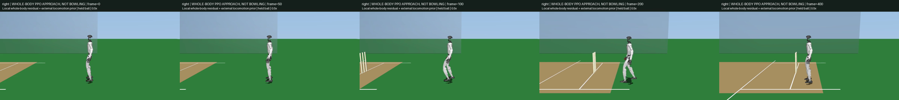
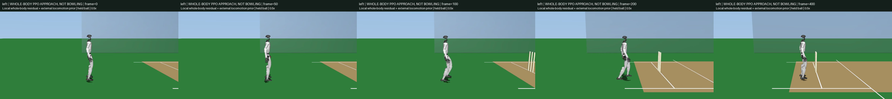

# Frozen-Policy Lane Feedback

The previous closed-loop PPO approach completes but drifts sideways. This
bounded comparison changes only the external locomotion policy's lateral speed
request: `clip(-lane_error / 1 second, -0.25, 0.25)` m/s. Lane error is world y
relative to the declared reset lane, sent as the prior's body-lateral request;
there is no additional yaw controller or world/body heading compensation.
The original forward command, prior history, both final local PPO actors,
geometry, gains, friction, timesteps and physical gates remain unchanged.

Evaluate all four hand x 62.5/31.25-us combinations from rest at seed 1, compared
with the immutable parent PPO outcomes. Verify identical compiled physics
models and source/checkpoint hashes; independently replay every native substep.
Keep complete traces and both finest-resolution half-speed videos regardless
of outcome. No training or checkpoint selection occurs. The command is an
explicit feedback controller, not a newly learned locomotion policy.

The target is lateral drift below the original 15 cm limit without losing
complete upright approach, legal-side foot coverage, settling or contact gates.
Loaded-foot slip below 0.2 m/s and integrated stance slip below 3 cm remain
required, not silently removed if lane control succeeds. This is a walking
approach experiment; gather, legal overarm release and recovery remain unfinished.

```sh
PYTHONPATH=src:scripts OMP_NUM_THREADS=2 uv run python \
  scripts/evaluate_g1_cricket_approach_lane.py \
  g1_cricket_results/approach_lane_v1
```

## Complete Results

Source `a10c1fdd2fc8b58ccbcf044722605834612abe38`; both frozen final actors and
all parent training provenance are unchanged. All four candidates complete
eight seconds upright, travel 2.821-2.826 m and settle. Lane feedback reduces
drift, but does not qualify either hand:

| Hand | Physics step (us) | Parent drift (cm) | Lane-feedback drift (cm) | Peak slip (m/s) | Stance slip (cm) |
| --- | ---: | ---: | ---: | ---: | ---: |
| Right | 62.5 | 17.0715 | 10.2261 | 2.2458 | 2.9636 |
| Right | 31.25 | 16.5840 | 9.8385 | 2.2400 | 3.0708 |
| Left | 62.5 | 26.0776 | 15.5761 | 2.5573 | 3.0881 |
| Left | 31.25 | 26.7284 | 15.3731 | 2.5535 | 3.1119 |

Right clears the 15 cm lane limit at both resolutions. Left still exceeds it;
all cases still fail peak slip. Right stance slip crosses 3 cm only at the finer
timestep, so its resolution comparison fails; left's comparison passes while
retaining all three failed gates. All other original checks pass. This is a
directional lane-control improvement with a stance-slip regression, not a gait
promotion or a running-bowling result. No thresholds or physics were changed.

All 768,000 substeps reproduce native endpoints/sensors exactly; measured slip
cost agrees within 3.34e-16. The [complete report](../g1_cricket_results/approach_lane_v1/summary.json)
retains the four candidates, all four parent PPO rows, input/checkpoint/model
fingerprints, traces and failure states. Both videos contain all 401 nonblank
960x540 frames at 25 fps, half speed; fixed-time sheets were inspected.

| Right-hand carry | Left-hand carry |
| --- | --- |
| [](../g1_cricket_results/approach_lane_v1/right_ppo_approach.mp4) | [](../g1_cricket_results/approach_lane_v1/left_ppo_approach.mp4) |

The parent finest traces locate their peak slip at loaded landings: right
2.7264/3.6764 s and left 2.7101/3.6669 s, with 146-178 N total foot load.
Above-threshold slip lasts 0.133-0.146 seconds per foot over each complete
episode. These are real short touchdown slides, not a lane-error proxy.
Next work should address landing-foot velocity and contact control; this lane
correction alone is insufficient. Full moving gather, overarm release and
recovery, plus the remaining batting tracking failure, are still outstanding.
