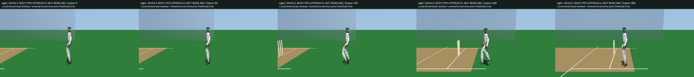
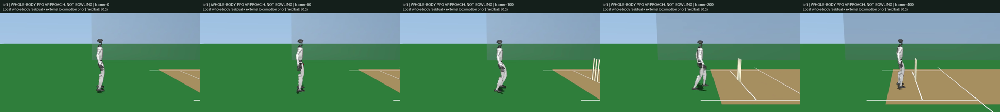

# Peak-Slip Learning Comparison

The closed-loop residual completes its approach but retains fast touchdown
sliding. Its original slip penalty averages squared contact speed across a
20 ms control interval. In the retained fine-grid PPO traces, replacing that
average with each foot's interval peak changes the full-episode slip penalty
from 1.016 to 4.719 (right) and 1.028 to 5.394 (left), at the same -5 weight.
Those are counterfactual reward calculations, not new policy outcomes.

This experiment changes only the `loaded_slip` reward function to the sum of
squared per-foot interval peak speeds. Contact points, >1 N load threshold,
sensor timing, physical model, zero-initialized 29-joint actor, observations,
forward command, other rewards and all PPO settings remain unchanged. It does
not include the separate lane-feedback trial. The external locomotion prior
remains explicitly external and frozen; no weights are redistributed.

Fresh right/left seed-1 actors each train for 256 updates x 24 steps x 8 CPU
environments = 49,152 transitions, matching the mean-slip parent. Use only the
final checkpoint. Evaluate both hands, zero residual and final PPO at both
62.5/31.25-us physics, seed 1 from rest; retain all eight outcomes and both
finest PPO videos, including falls. No checkpoint or favorable-seed selection.

The target remains raw peak loaded-foot slip <0.2 m/s, with all original lane,
stance slip, stability, joint/motor, contact, holder and resolution gates.
Higher training reward or smaller mean slip cannot replace peak-slip success.
Do not extend the pilot just because training improves. A failed final pool
closes this reward-only pilot as a full solution; diagnose the actual landing
controller before scaling compute. Walking/carry remains distinct from the
requested continuous running gather, legal overarm release and recovery.

```sh
PYTHONPATH=src:scripts OMP_NUM_THREADS=2 uv run python \
  src/unilab/scripts/train_rsl_rl.py \
  task=g1_cricket_approach_peak_slip/mjbatch env.handedness=right \
  training.log_dir=g1_cricket_results/approach_peak_slip_v1/ppo_right
```

Repeat for `left`/`ppo_left`; retain iteration diagnostics and evaluate with
`evaluate_g1_cricket_approach_learning.py`, the new result directory and
`--action-name residual --render`. Finish with the existing approach reporter.
Both physical scene and controller commands must reproduce the parent under
identical actions; only the reward may differ.

## Complete Results

Both clean-source runs at `e46b26653e121bc7dd7e5ef56fac113b31a2c245` finish
49,152 transitions in 1,846/1,850 seconds. Final checkpoint tensors and all
25 scalar series are finite; all 256 iteration records match TensorBoard.
Initial weights, redundant events and the unrelated runtime diff were removed
after retaining final weights, complete configuration/summary and portable data.

All eight reference/PPO x hand x timestep episodes finish eight seconds upright.
All four complete zero-residual traces match the mean-slip parent exactly,
including every state, control and substep measurement. All four resolution
comparisons pass, but the failed physical checks remain failed.

| Hand | Physics step (us) | Parent peak slip (m/s) | New peak slip (m/s) | New stance slip (cm) | New lateral drift (cm) |
| --- | ---: | ---: | ---: | ---: | ---: |
| Right | 62.5 | 2.2266 | 2.2376 | 2.9482 | 20.3792 |
| Right | 31.25 | 2.2272 | 2.2505 | 2.9791 | 20.3087 |
| Left | 62.5 | 2.5369 | 2.5267 | 3.3320 | 26.5712 |
| Left | 31.25 | 2.5328 | 2.5250 | 3.1131 | 26.0989 |

Every PPO case fails loaded-slip speed and lateral drift; left also fails
integrated stance slip. All other original checks pass. Right peak slip and
drift regress; left's tiny speed reduction does not close a gate. **The reward-only
pilot is rejected as a solution**, with no checkpoint promotion or budget extension.
Returns under the two reward functions are not directly comparable.

The [full report](../g1_cricket_results/approach_peak_slip_v1/summary.json)
retains all outcomes and raw traces, 101 source/input fingerprints and 23
artifact hashes. All 1,536,000 substeps pass exact independent native replay;
slip-cost sensor error is at most 3.34e-16. Both finest videos decode all
401 nonblank 960x540 frames, 25 fps at half speed; fixed-time sheets inspected.
They remain walking/carry diagnostics, not bowling highlights. 35 focused tests
pass, including same-action physical/observation equivalence in both hands and
peak-reward agreement with independent native touchdown speeds within 1e-12.

| Right-hand carry | Left-hand carry |
| --- | --- |
| [](../g1_cricket_results/approach_peak_slip_v1/evaluation/right_ppo_approach.mp4) | [](../g1_cricket_results/approach_peak_slip_v1/evaluation/left_ppo_approach.mp4) |

The final deterministic target correction never exceeds 0.00850 rad right or
0.00717 rad left, despite the unchanged 0.1 rad bound. Initial exploration has
only 0.002 rad target standard deviation. Limited exploration is a testable
hypothesis, not a proven cause: audit whether larger bounded perturbations can
change touchdown velocity without destroying balance before another training
batch. Do not repeat penalty-only adjustments or claim a completed run-up and
delivery from these stable carry clips. Existing batting footage is unchanged.
Approach-only refinement must not replace building the continuous moving
gather/release/recovery prototype. Such a prototype may retain failed gait
checks during development; it cannot become a qualified showcase until the
complete motion and all required physical checks have been verified.
