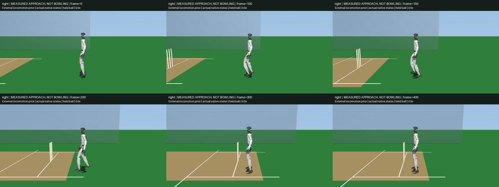
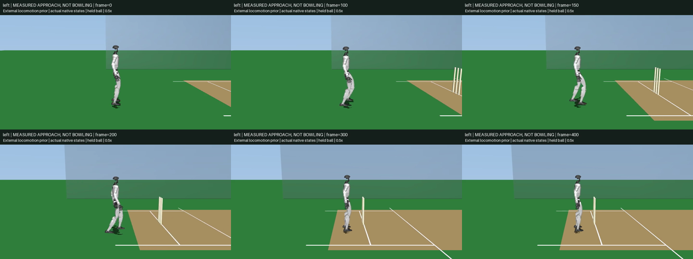

# Physically Achieved Bowling Approach

The hand-prescribed first-step references have not survived a complete physical
rollout, even after three local PPO variants. This experiment instead records
the live, externally trained Unitree locomotion policy as a possible teacher
for the approach stage. It does not replace the required gather, legal overarm
release, recovery or locally learned whole-body cricket controller.

## Fixed Protocol

Use the existing delivery PitchV2 scene, original robot/holder/contact parameters
and Unitree deploy gains. Translate the reset robot and held ball together to
`x=-4.5 m`, `y=+/-0.7 m`; retain actual bowler and striker wickets and crease
geometry. No live pose writes or external root forces. All eight task actions
are zero: the external prior controls locomotion, with no learned arm residual
or release. Its asset hashes are pinned and verified; weights stay local-only.

At the existing 20 ms control rate, request forward velocity:

| Time (s) | Command (m/s) |
| --- | --- |
| 0-1 | 0 |
| 1-2 | Linear ramp 0 to 1 |
| 2-4 | 1 |
| 4-5 | Linear ramp 1 to 0 |
| 5-8 | 0 |

Keep every outcome from both hands, seeds 5301/5302, and 62.5/31.25 microsecond
physics: eight complete cases. No seed, checkpoint, trajectory or timestep
selection. Optional videos always show seed 5301 at the finer timestep for
both hands, including failure. A command of 1 m/s does not establish running.

## Acceptance and Export

Require all eight seconds, pelvis above 0.65 m and up component above 0.95,
original joint/motor bounds, no unintended contacts, holder error below 1 mm,
ball penetration at most 6 mm and no release. Actual foot collision footprints
must remain inside the +/-1.32 m corridor and on the declared wicket side;
root lateral drift must stay below 0.15 m. This is approach-lane checking,
not delivery-stride legality.
At foot-pitch contacts loaded above 1 N, require tangential contact-point speed
below 0.2 m/s and integrated slip below 3 cm per contiguous loaded stance.
Use solved-frame body velocity at the contact point, allowing normal foot roll;
do not equate ankle displacement with skating or reuse a planted-foot bound.

Require 2.4-3.6 m forward displacement, mean actual forward velocity between
0.7 and 1.3 m/s during seconds 3-4, and at least two measured airborne-to-loaded
landings per foot. Over both initial 0.5-1 s and final 7.5-8 s windows, require
root linear speed below 0.05 m/s, angular speed below 0.2 rad/s, maximum joint
speed below 0.5 rad/s, both feet loaded above 1 N, and mean support within 2%
of weight. These predeclared approach checks do not replace the full bowling gate.

Paired resolutions must agree on every gate and landing count, final root
position within 5 cm, peak holder force within 5% or 1 N, and peak holder error
within 0.1 mm. Simulated holder loads are uncalibrated fixture forces; geometric
touch is not hardware tactile pressure.

Every native interval is independently replayed with its actual held targets;
endpoint state and complete sensor values must match exactly. Retain full
control-boundary states, native qpos/qvel, executed motor targets, prior actions,
velocity commands, equality state, contact/support telemetry and interval
holder loads/impulses/touch. Export MotionLoader FK with the **recorded native
velocities**, not finite differences of sampled positions. The existing running
tracker adds controller terms absent from the prior, so poses alone are not a
replay contract: future teacher-target residual control must preserve executed
commands and be physically validated separately.
Integrated states carry end-of-substep times; contact/load/geometry and slip
measurements are from the solved-start frame one physics step earlier. Retain
the resolved owner, all source/mesh/compiled-model hashes, recorder hash and
dependency versions alongside these timing semantics.

```sh
PYTHONPATH=src:scripts OMP_NUM_THREADS=2 uv run python scripts/evaluate_g1_cricket_approach.py \
  g1_cricket_results/approach_teacher_v1 --render
```

Passing this approach study would yield teacher data, not a finished bowling
video, independently trained Menagerie policy or hardware demonstration.

## Complete Results

Source `6bbd8bd34eebcf77a6298f1b1b989f3ba6dc578e`; the
[complete report and traces](../g1_cricket_results/approach_teacher_v1/summary.json)
retain all eight outcomes. All finish eight seconds, register six landings per
foot, and pass initial/final settling, height/orientation, original joint/motor
limits, holder, penetration, contact, corridor and wicket-side checks.
**None qualifies:** every case fails the 0.2 m/s loaded-contact slip bound.

| Hand | Seed | Physics (us) | Travel (m) | Lateral drift (m) | Peak slip (m/s) | Maximum stance slip (m) |
| --- | --- | --- | --- | --- | --- | --- |
| Right | 5301 | 62.5 | 2.842813 | 0.137710 | 2.256278 | 0.029274 |
| Right | 5301 | 31.25 | 2.838926 | 0.153229 | 2.277514 | 0.030575 |
| Right | 5302 | 62.5 | 2.850108 | 0.137935 | 2.295869 | 0.029905 |
| Right | 5302 | 31.25 | 2.844369 | 0.140389 | 2.289119 | 0.029197 |
| Left | 5301 | 62.5 | 2.827117 | 0.250024 | 2.547817 | 0.030654 |
| Left | 5301 | 31.25 | 2.823627 | 0.245505 | 2.539272 | 0.030502 |
| Left | 5302 | 62.5 | 2.827646 | 0.251992 | 2.537859 | 0.032916 |
| Left | 5302 | 31.25 | 2.825143 | 0.257863 | 2.542415 | 0.032689 |

All left cases and right/5301/31.25 us also fail the unchanged 0.15 m drift
and 0.03 m stance-slip bounds. Three of four resolution comparisons pass;
right/5301 fails because those two gate outcomes change with timestep.
This is not a converged, accepted approach teacher.

Independent replay of the right/5301/62.5 us peak at about 3.6671 s confirms
2.2563 m/s contact-point slip with 162.066 N normal and 97.239 N tangential
load, at the original 0.6 friction limit. The interval endpoint matches exactly:
the slip is physical motion against saturated friction, not an ankle-position
proxy or timing artifact. No friction or acceptance thresholds were changed.

All 1,536,000 native substeps pass exact endpoint/sensor replay. All 84 input
hashes, recorder hash and 20 artifact hashes verify. Each trace retains 401
states and 400 controls, finite native velocities and full substep telemetry;
157 focused tests pass with warnings as errors. No local policy was trained
in this experiment, and no upstream PR or social publication was made.

## Whole-Body Transfer

The next controller should apply the recorded 29 motor targets plus bounded
learned residuals, without the current running tracker's additional gravity,
velocity, ankle, waist or root-position corrections. The prior sometimes
requests ankle targets outside the joint position range while actual joints
remain within limits; adding target clipping would change the replay and must
be evaluated as a separate controller change. Original motor force caps remain.

Initialize both robot and held ball from the measured pose and velocity,
including compliant holder displacement. Preserve velocity coordinate frames;
do not reconstruct an ideal rigid wrist attachment or clip measured reset poses.
There are 401 states but only 400 executed commands: the terminal state is not
a valid command-sampling start. Verify zero-residual replay before local PPO.
The gather must start from a moving approach state with continuous position
and velocity, not by joining the stopped tail to the old delivery reference.
Approach slip failures remain failures throughout transfer and learning.

## Diagnostic Videos

[Right-hand approach](../g1_cricket_results/approach_teacher_v1/right_approach.mp4)
and [left-hand approach](../g1_cricket_results/approach_teacher_v1/left_approach.mp4)
retain the predeclared seed 5301 finer-grid trajectories, including failures.
Each has 401 nonblank 960 x 540 frames at 25 fps, showing eight simulated
seconds at half speed. These are recorded native states, not offline targets.
The ball stays in a mechanical holder; no gather or release occurs.

The inspected contact sheets sample frames 0, 100, 150, 200, 300 and 400
(simulation times 0, 2, 3, 4, 6 and 8 s), without outcome-based selection:



