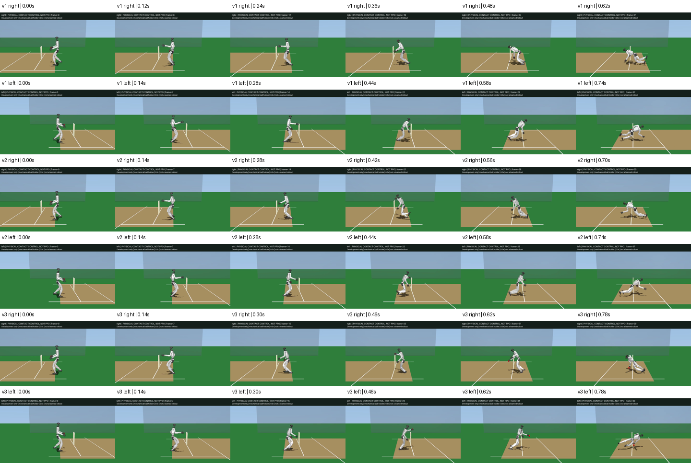

# Contact-Aware Running Control

These are complete failed motor-only experiments on both G1 hands, not trained
policies or bowling showcases. The full 2.70 s momentum-repaired delivery
reference is unchanged; none of these physical episodes reaches release.



## Method

The controller predicts generalized accelerations with native `mj_forward` on
an isolated copy of the live state. This includes the original contact/friction,
joint-stop and held-ball constraints. It never advances or writes the live
root, applies external support, changes inertia or enlarges motor limits.
See [MuJoCo forward dynamics](https://mujoco.readthedocs.io/en/stable/computation/index.html#forward-dynamics).

Two bounded least-squares steps choose all 29 motor setpoints. The fixed target
is reference acceleration plus position/velocity feedback (80 and 18), with
base task weight 2 and joint weight 0.2. Setpoint regularization is 4, relative
to the original balanced PD command; each solve limits its increment to 0.3 rad
and preserves the original setpoint and force limits. Finite differences use
1e-4 rad and each candidate is checked against the actual nonlinear forward
objective before acceptance. That local objective is not a physical success
metric: contact changes and multi-step balance are not predicted by it.

The first comparison holds commands for 20 ms. The second changes only contact
control refresh to 2 ms, retaining the same held 20 ms reference. The third
adds both feet's world-space acceleration tasks with weight 4, the same 80/18
feedback and native `J qacc + Jdot qvel` mapping. No foot load or root force is
injected. The optional experimental controller is not enabled in training or
the default PD runner.

## Complete Results

| Controller | Hand | First joint-stop violation (s) | Fall (s) | Maximum excursion (rad) |
| --- | --- | ---: | ---: | ---: |
| Original PD | Right | 0.146313 | 0.68 | 0.08992 |
| Original PD | Left | 0.146250 | 0.68 | 0.08955 |
| Contact, 20 ms | Right | 0.435500 | 0.62 | 0.09166 |
| Contact, 20 ms | Left | 0.371000 | 0.74 | 0.08127 |
| Contact, 2 ms | Right | 0.413375 | 0.70 | 0.06596 |
| Contact, 2 ms | Left | 0.391250 | 0.74 | 0.06906 |
| Contact + feet, 2 ms | Right | 0.416938 | 0.78 | 0.10041 |
| Contact + feet, 2 ms | Left | 0.219062 | 0.78 | 0.02269 |

Reports retain every optimizer call and failed episode:
[20 ms](../g1_cricket_results/running_contact_control_v1/evaluation.json),
[2 ms](../g1_cricket_results/running_contact_control_v2/evaluation.json),
and [2 ms with feet](../g1_cricket_results/running_contact_control_v3/evaluation.json).
The original baseline is in the [stance audit](g1_cricket_running_stance.md).

The 2 ms variant has foot-crossing and wicket contacts; its left ball briefly
contacts a wicket with 5.52 mm penetration. Explicit foot tracking removes
wicket contacts in this fixed pair, but right thigh/shin and hand/hip contacts
remain, as do left shin/thigh and thigh/thigh contacts. Both latest ball
penetration maxima are zero, but that does not qualify a delivery. All motor
force fractions remain at or below 1. Every bounded solve reports convergence;
each accepted local objective decreases, yet every physical episode fails.
No candidate replaces the baseline or clears any cricket/physical gate.

## Verification And Next Step

All 65 focused running/reference/delivery tests pass with warnings as errors;
Ruff passes. Tests verify scratch-state isolation, original geometry/force/joint
limits, actual operating-point acceleration derivatives, finite-difference foot
acceleration, unchanged reference cadence and exact baseline replay. Contact
derivatives are only local: an arbitrary zero-position-offset operating point
crosses a friction regime and is not differentiable in the same way. Nonlinear
candidate checks remain essential, and cannot prove future rollout stability.

All 224 video frames decode nonblank and the six-episode review was inspected.
The [latest right](../g1_cricket_results/running_contact_control_v3/right.mp4) and
[latest left](../g1_cricket_results/running_contact_control_v3/left.mp4) videos
are complete 0.5x physical diagnostics, not PPO. Earlier duplicate videos are
pruned after inspection; full poses, substep traces, optimizer reports and the
comparison sheet remain. Historical source hashes resolve against frozen
`054ae47f` (v1) and `79047abe` (v2); current v3 hashes match its generator.
Earlier accepted cricket videos and batting evidence remain unchanged.

The next control design needs multi-step support/contact-phase planning and
leg separation, not another claim based on a lower instantaneous objective
or a later fall. Keep the full run-up, delivery and recovery; do not substitute
standing arm motion, root assistance or relaxed limits. No new PPO, independent
Menagerie running result, upstream PR or social publication is claimed here.

```sh
PYTHONPATH=src:scripts OMP_NUM_THREADS=2 uv run --no-project \
  --python ../unilab_submission_checkout/.venv/bin/python \
  python scripts/evaluate_g1_cricket_contact_control.py \
  g1_cricket_results/running_momentum_v1 g1_cricket_results/running_contact_control_v3 \
  --controller-substeps 32 --track-feet --render
```

Outputs are immutable: the selected directory must not already exist.
