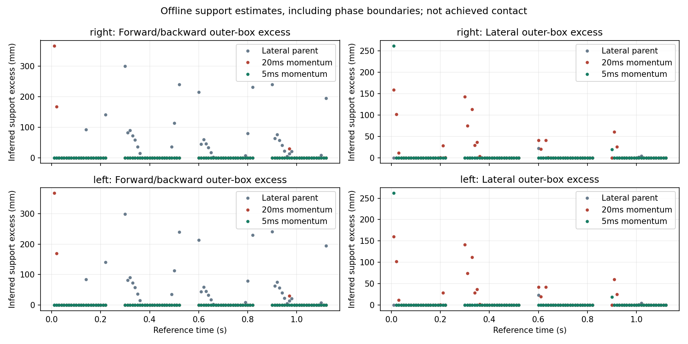
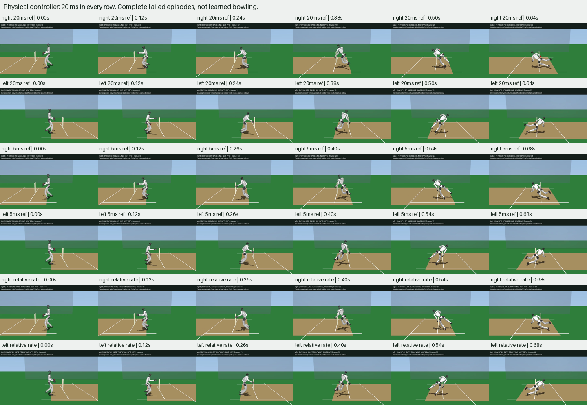
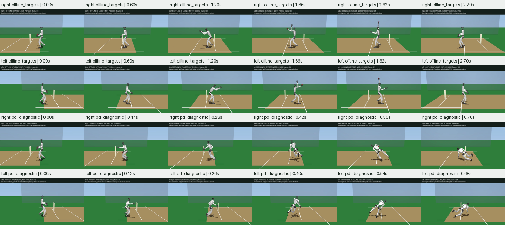

# Running Stance Momentum

The preceding lateral-support reference still required fore/aft ground-force
locations outside its planted feet. This candidate changes only the run-up
centroidal angular-momentum target, retaining the full lateral-support COM,
foot and arm targets, stride/release times, original model and controller.
It is offline retargeting followed by unassisted native PD, not learned bowling.

## Complete Results



Both hands retain all 119 run-up times at two derivative resolutions. At the
finer 0.625 ms derivative resolution, 91 samples per hand have defined support
estimates, including seven phase-boundary samples. The projected foot box is
a necessary outer bound, not a complete contact or actuator certificate.

| Reference | Fore/aft violations, right/left | Lateral violations, right/left | Physical fall, right/left |
| --- | --- | --- | --- |
| Lateral-support parent | 33/33 of 91 | 3/3 of 91 | 0.66/0.66 s |
| Stance momentum, 20 ms knots | 3/3 of 91 | 18/18 of 91 | 0.64/0.64 s |
| Stance momentum, 5 ms knots | 0/0 of 91 | 2/2 of 91 | 0.68/0.68 s |

The dense reference removes sampled fore/aft violations, but does not pass:
lateral support excess reaches 261.3/261.9 mm at startup (0.01 s), and another
violation occurs at the 0.90 s landing boundary. Discrete momentum errors below
5e-13 Nms over 240 intervals per hand do not certify interpolated dynamics.
The dense reference also has a shoulder/torso overlap of 1.99/2.03 mm at
0.995 s, maximum foot error 5.01/5.02 mm and arm error below 5.91 mm. All IK
solves terminate successfully, but that cannot override these defects.



The relative-rate comparison below reproduces both absolute-rate parent pose
sequences bit-for-bit. Both settings fall at 0.68 s with hand/hip/thigh/wrist
contacts, no release and no ball penetration. Absolute-rate first joint-stop
crossings are 0.18175/0.18181 s; relative-rate crossings are slightly earlier,
0.17875/0.17881 s. Relative-rate peak joint excess is 0.08601/0.08575 rad,
versus 0.08935/0.08910 rad for absolute damping. It is not a successful control
fix and is not enabled in the default controller or existing trained actors.

Complete [coarse](../g1_cricket_results/running_ground_momentum_v1/evaluation.json),
[dense](../g1_cricket_results/running_ground_momentum_v2/evaluation.json), and
[four-row rate comparison](../g1_cricket_results/running_velocity_v1/evaluation.json)
reports remain, with all reference/control knots and 43,520 substeps for the
rate comparison. Frozen source revisions are `d2e545b7`, `634385fd`, and
`40f899eb`. The corresponding 36/36/38 input hashes verify; both support
audits' 37-input fingerprints also verify against their frozen sources.
All 101 focused tests pass with warnings as errors, including shared batting
balance regressions; Ruff passes. All 750 generated frames decode nonblank,
and the motion/support reviews were inspected. Redundant coarse MP4s were
pruned after review; complete poses, reports and the comparison sheets remain.
The dense and relative-rate videos are retained as failed diagnostics.

The subsequent full-body audit below rejects this dense reference as an
executable target, even with optimistic ideal support. Do not equate
centroidal support or lower joint error with a runnable teacher, relax the
physical gates, or train PPO on this reference as if it passed. Batting and
the independent Menagerie integration are unchanged and unfinished.

## Native Dynamics and Motor Authority

The [complete inverse-dynamics audit](../g1_cricket_results/running_ground_momentum_v2/inverse_dynamics_audit.json)
retains all 119 run-up times per hand at both derivative spacings, including
startup, flight and landing boundaries. Source `71a2d8af` uses the original
41-DOF model, 62.5 us timestep, motor limits, friction and active ball holder.
It reconstructs velocities and accelerations from the dense reference and
uses [MuJoCo inverse dynamics](https://mujoco.readthedocs.io/en/latest/computation/)
to separate required joint-motor forces from unactuated root/ball residuals.
Position-command reachability also includes the existing joint-range clipping
and velocity-dependent actuator bias. These are inferred requirements, not
applied assistance or measured contact telemetry.

At 0.625 ms spacing, 80/119 samples per hand exceed native motor-force limits;
76/112 non-boundary samples also fail. Ninety samples per hand exceed the
forces reachable through the bounded position commands. Native inverse forces
include the consequences of contact/compliance mismatch and must not be
interpreted as the unique force requirement of every nearby motion.

A separate ideal-support linear program isolates motor authority from that
soft-contact mismatch. It retains full-system mass, bias and passive forces,
but deliberately grants outer rectangular foot patches within 2 mm of the
ground, outer-square friction, unrestricted yaw moment, an ideal internal
six-axis holder reaction and dry-friction forces anywhere inside the original
friction-loss bounds. It cannot exploit joint-stop or forbidden-contact forces.
Even passing this generous instantaneous test does not prove physical motion.

| Ideal-support feasible samples per hand | 1.25 ms differences | 0.625 ms differences |
| --- | --- | --- |
| Unbounded motors | 90/119 | 89/119 |
| Original motor-force caps | 59/119 | 56/119 |
| Original caps and bounded position commands | 46/119 | 45/119 |

Every feasible allocation is checked against all 41 equations, wrench
inequalities and variable bounds to 1e-6. Other solver errors fail the audit
rather than being labeled physical infeasibility. The differing resolutions
remain visible; no continuous-time or derivative-convergence certificate is
claimed.

The worst finite optimistic motor-scale requirement is at the 0.30 s landing:
19.57/right and 19.78/left at the finer spacing, versus 17.32/17.51 at the
coarser spacing. Bowling-wrist yaw is the limiting joint. In the right-hand
dense samples, its rate changes from +8.68 to -11.02 rad/s over 5 ms, while
the optimistic inverse allocation requires about 97.83 Nm against its 5 Nm
cap. The scale is an offline diagnostic variable; hardware/model limits are
never increased. This motivates a bounded temporal wrist-smoothing comparison,
not another controller-gain adjustment or unchanged PPO run.

Reproduce with the same environment as below:

```sh
PYTHONPATH=src:scripts OMP_NUM_THREADS=2 uv run --no-project \
  --python ../unilab_submission_checkout/.venv/bin/python \
  python scripts/audit_g1_cricket_reference_dynamics.py \
  g1_cricket_results/running_ground_momentum_v2
```

The command refuses to overwrite an existing audit. Analytic tests cover
motor saturation, command/damping reachability, unsupported gravity, support
location, ideal motor scaling and bounded dry friction. Both G1 hands also
recover native forward-dynamics forces through inverse dynamics with real
contacts, satisfy the full mass-matrix equation and admit a bounded ideal
allocation without editing the model or stepping physics inside the audit.

## Wrist Smoothing Comparison

Source `09b3cbdb` adds an opt-in penalty on the six wrist joints' finite-difference
accelerations, with weight `0.0002` and zero initial wrist velocity. The full
541-knot reference keeps the same COM, angular momentum, foot and arm targets,
timing and robot. Default retargeting, physical controllers and trained actors
are unchanged. Reproduce the dense command below with output
`g1_cricket_results/running_wrist_smooth_v1` and
`--wrist-acceleration-weight 0.0002`; run both support and inverse-dynamics
audits on that directory afterward.

At the finer derivative spacing, optimistic motor-cap feasibility improves
from 56/119 per hand to 78/119 right and 79/119 left. With bounded position
commands it improves from 45 to 57 per hand. The worst finite motor-scale
requirement drops from 19.57/19.78 to 6.78/6.85, now at the non-bowling shoulder
pitch joint at 1.01 s. At the coarser spacing, cap feasibility is 79 per hand,
bounded-command feasibility is 56, and peak scale is 6.17/6.23. All rows remain
in the [new inverse report](../g1_cricket_results/running_wrist_smooth_v1/inverse_dynamics_audit.json).
These diagnostic improvements do not qualify the motion: native root-force
residual peaks actually worsen to 37.45/37.91 kN, reflecting the remaining
soft-contact/reference mismatch, not forces applied to a successful robot.



Physical PD still falls at 0.70/right and 0.68/left seconds, before release,
with maximum joint-stop excess 0.08470/0.08477 rad and hand/hip/thigh/wrist
contacts. All offline IK solves converge, but each reference now contains four
hand-thigh intersections between 0.695 and 0.710 s, peaking at 2.93/2.90 mm.
Foot error reaches 5.60/5.61 mm and arm error 6.10/6.11 mm. Sampled support
still has one lateral violation per hand, despite zero fore/aft violations.
This candidate is **not promoted** and is not used to retrain PPO.

| Evidence | Right | Left |
| --- | --- | --- |
| Offline target, not physics | [Video](../g1_cricket_results/running_wrist_smooth_v1/right_offline_targets.mp4) | [Video](../g1_cricket_results/running_wrist_smooth_v1/left_offline_targets.mp4) |
| Complete failed physical episode | [Video](../g1_cricket_results/running_wrist_smooth_v1/right_pd_diagnostic.mp4) | [Video](../g1_cricket_results/running_wrist_smooth_v1/left_pd_diagnostic.mp4) |

The [full evaluation](../g1_cricket_results/running_wrist_smooth_v1/evaluation.json),
[support audit](../g1_cricket_results/running_wrist_smooth_v1/support_audit.json),
all poses and all failed episodes are retained. All 343 video frames decode
nonblank; the full-motion review was visually inspected. The 541 dense knots
subsample exactly to all 136 control knots. All 37 generator fingerprints and
38 fingerprints for each audit verify; baseline audit fingerprints verify
against source `71a2d8af`. All 109 focused tests pass with warnings as errors.

The next repair must account for whole-body joint accelerations and explicit
hand-thigh clearance, not merely add more wrist smoothing. Full native
contact consistency and complete physical delivery qualification are still
required before training or showcasing this running reference.

## Construction

The COM advances at constant forward velocity during the run-up. Its stance
vertical acceleration is constant, giving `F_z = mass * (gravity + z_ddot)`.
Choose a fixed fore/aft CoP at the COM's position halfway through each 0.22 s
stance. Required pitch torque is then `F_z * velocity_x * (phase - 0.11)`.
Integrating gives a pitch-momentum offset
`F_z * velocity_x * phase * (phase - 0.22) / 2`, returning to zero at takeoff.
Momentum is constant through each 0.08 s flight. The lateral COM already
supplies the alternating-foot force with zero required roll torque.

The constant momentum offset preserves the parent's mean over its first
complete 0.60 s gait cycle; there is no outcome-based seed or checkpoint
selection. Initial momentum and inferred vertical force are recorded in the
evaluation. The held-ball implicit-midpoint solver now determines offline
root rotation throughout stance and flight, instead of forcing the torso
back to level at every landing. After 1.20 s it uses the existing gather
recovery. No live root forces, pose writes, joint-limit changes or prescribed
ball velocity are introduced.

The ideal reduced-model support relation is not a full feasibility proof.
Whole-body retargeting, interpolation, joint limits, motor authority, yaw
friction and contacts can still invalidate it. The full-momentum support audit
and both complete physical trials remain required, including failed motion.

The coarse candidate uses 20 ms retargeting. Its discrete momentum matches do
not prevent large derivative errors between frames. A fixed 5 ms refinement
keeps the same mechanism and 20 ms physical controller, saves all 541 dense
poses per hand, and uses the corresponding dense forward-difference velocity
at each control knot. The support audit reads the dense reference explicitly,
not a cubic reconstruction from only the 136 control knots.

```sh
PYTHONPATH=src:scripts OMP_NUM_THREADS=2 uv run --no-project \
  --python ../unilab_submission_checkout/.venv/bin/python \
  python scripts/retarget_g1_cricket_running.py \
  g1_cricket_results/running_ground_momentum_v2 --render \
  --ballistic-parent g1_cricket_results/running_front_raise_v1 \
  --lane-offset 0.2 --conserve-momentum --lateral-support \
  --ground-momentum-parent g1_cricket_results/running_support_v1 \
  --retarget-substeps 4
```

Then run `scripts/audit_g1_cricket_running_support.py` on the output directory.
Existing output directories are not overwritten. Passing an offline momentum
check cannot qualify a physical bowling delivery or authorize showcase claims.

## Reference Angular Rate

The existing ankle balance term damps absolute angular velocity. At the exact
initial dense target, intended pitch rate is about 3.58 rad/s, yet this term
adds its maximum 0.3 rad ankle correction. An opt-in comparison instead
subtracts desired angular velocity after expressing both rates in the reference
body frame. An exactly tracked rotating target then has zero rate error.
The default controller and existing learned-policy behavior remain unchanged.

`scripts/evaluate_g1_cricket_running_velocity.py` compares both settings for
both hands against the frozen dense reference, retaining all substep records.
The absolute-rate controls must reproduce the saved parent poses bit-for-bit.
Only relative-rate videos are newly rendered; parent baseline videos remain
in the reference directory. Use reference directory
`g1_cricket_results/running_ground_momentum_v2` and a fresh output directory
`g1_cricket_results/running_velocity_v1`, with `--render`.
