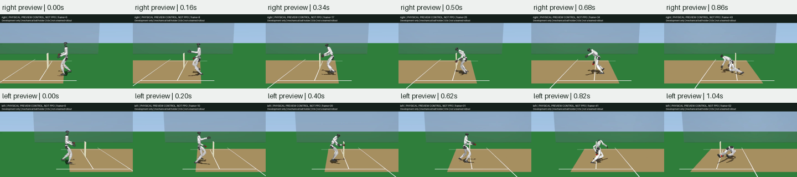

# Native Running Preview

This experimental controller evaluates future native physics before applying
one bounded 20 ms motor command. It is not a learned policy, and its planning
objective cannot qualify a bowling delivery or replace full physical gates.

## Complete Physical Results



| Hand | Fall time | Joint-limit excess | Ball penetration | Release |
| --- | ---: | ---: | ---: | --- |
| Right | 0.86 s | 0 rad | 0 mm | No |
| Left | 1.04 s | 0 rad | 0.761 mm | No |

The original PD baseline fell at 0.68 s in both hands and crossed a joint
stop near 0.146 s. Preview avoids joint-limit crossings in these two fixed
episodes, but neither reaches the scheduled 1.82 s release. Right-arm
elbow/hand/wrist contacts with the thigh/hip and left-hand contacts with the
hip/thigh/pitch remain disqualifying. Both reach the original motor-force
caps without exceeding them. This is not evidence of learned bowling.

The planner makes 43/52 decisions and evaluates 2,064/2,496 candidates. Its
final selected horizon is already predicted unsafe at five/six decisions,
starting at 0.76/0.92 s. Each hand has twelve search stages with no safe
candidate. The penalty cannot create a viable continuation when the local
sampled plans have none; simply reporting the minimum cost would hide this.
These counts are local search outcomes, not proof that no feasible motion exists.

The [complete report](../g1_cricket_results/running_preview_v1/evaluation.json)
retains every candidate score and unsafe flag. Full endpoint poses and 30,400
actual substep records are retained alongside the
[right](../g1_cricket_results/running_preview_v1/right.mp4) and
[left](../g1_cricket_results/running_preview_v1/left.mp4) diagnostic videos.
All 97 video frames decode nonblank; the fixed, evenly spaced review above
was inspected. The run took 1,119.5 seconds on two rollout threads. All 34
input fingerprints match source commit `a36b7439269cd8d0e2e6e0c95dfb2517015500c4`.

All 73 focused tests pass with warnings as errors, including eight preview
model/isolation/substep tests; Ruff passes. No new PPO was trained. The next
requirement is a recoverable support/landing plan across contact transitions,
with arm/body clearance and full delivery validation, before using this as
a training teacher. Extending the horizon alone is not a validated remedy.

## Fixed Design

The complete momentum-repaired running reference, original robot, joint limits,
motor caps, 62.5 microsecond physics and scheduled release remain unchanged.
Every decision evaluates two rounds of 24 candidate six-command sequences:
a 120 ms horizon. Seed 1 and two native rollout threads are fixed for both
hands. Candidates include the shifted previous plan, nominal reference PD,
the contact-aware foot-tracking controller's offset, and sampled smooth motor
offsets. Sampling scales are 0.12 and 0.06 rad; all commands are clipped to
the original limits. Only the selected first command reaches the live robot.

The native [MuJoCo rollout API](https://mujoco.readthedocs.io/en/stable/python.html#rollout)
advances scratch states with the same timestep, warm start and holder-release
schedule. No live pose/root write, root force or prescribed ball velocity is
introduced. Prediction uses the same physical model with a smaller sensor
set: six foot-position values and five signed inter-leg distance probes.
The real evaluation retains the original full force/contact diagnostics.

The objective averages root-position, orientation, joint and foot tracking
with weights 200, 40, 2 and 100. Every predicted substep is checked for joint
excursion above 1e-6 rad, inter-leg penetration above 1 mm, pelvis height below
0.48 m, non-increasing simulation time and non-finite state. Unsafe candidates
receive a penalty, not a guarantee: if all candidates are unsafe the chosen
command can still fail. Full actual contact and cricket gates remain required.
The five distance probes are planning heuristics, not complete collision coverage.

The reduced sensor model must match the original inertias, geometry, collision
masks, actuator parameters, constraints and solver settings. Native replay tests
compare every state across initial stance and scheduled release; planning must
leave the entire live integration state unchanged. Tests also inject violations
between control frames to ensure the penalty uses all predicted substeps.

```sh
PYTHONPATH=src:scripts OMP_NUM_THREADS=2 uv run --no-project \
  --python ../unilab_submission_checkout/.venv/bin/python \
  python scripts/evaluate_g1_cricket_contact_control.py \
  g1_cricket_results/running_momentum_v1 g1_cricket_results/running_preview_v1 \
  --preview --render
```

The output directory must not already exist. Retain both complete episodes,
all candidate scores and physical failures; do not report the chosen planning
row as an independently verified outcome.
