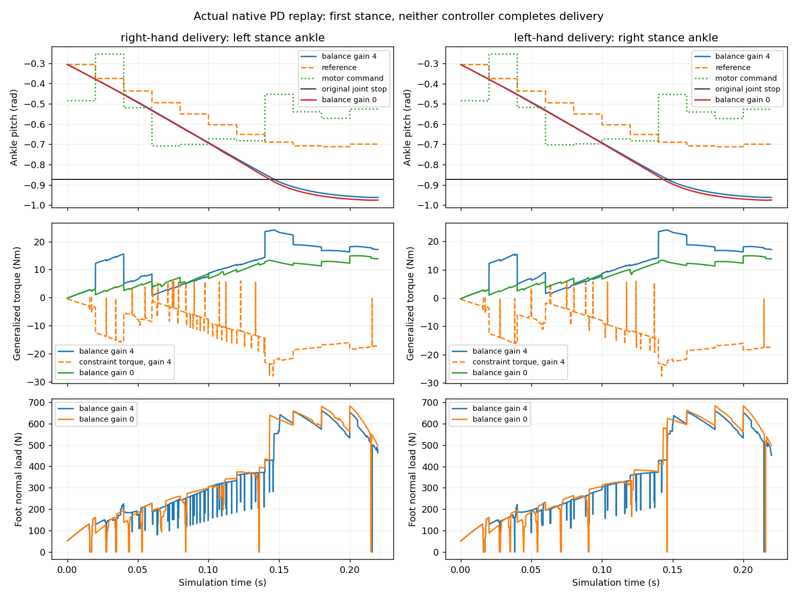

# Running Stance Diagnosis

The subsequent [whole-body contact-control comparisons](g1_cricket_contact_control.md)
test native acceleration feedback and explicit foot tracking; all remain failed
physical experiments, not a qualified running teacher.

This fixed comparison replays both complete `running_momentum_v1` references
with the original PD controller and with its ankle balance correction disabled.
Only that correction changes. Neither hand completes delivery under either
controller; this is not a new learned policy or a bowling showcase.



The [complete report](../g1_cricket_results/running_stance_v1/evaluation.json)
indexes all four compressed substep traces and physical pose sequences.
No episode or failed interval is discarded. Forces, accelerations and contact
caches describe the native step's start; endpoint positions follow integration.
Commands are held for 20 ms, with physics at 62.5 microseconds. Foot loads are
sums of actual simulated contact normal forces, not predicted support loads;
generalized constraint torque also includes joint stops and the ball holder.

| Hand | Balance gain | First limit crossing (s) | Fall (s) | Maximum joint excursion (rad) |
| --- | ---: | ---: | ---: | ---: |
| Right | 4 | 0.1463125 | 0.68 | 0.08992 |
| Right | 0 | 0.1431875 | 0.64 | 0.10343 |
| Left | 4 | 0.1462500 | 0.68 | 0.08955 |
| Left | 0 | 0.1432500 | 0.64 | 0.10332 |

The first violating joint is the opposite-side stance ankle pitch. With the
original controller, its command is approximately -0.453 rad, well away from
the -0.87267 rad lower stop, while the reference is -0.689 rad. The ankle is
still moving toward that stop at 3.67-3.70 rad/s. Motor torque is already
corrective at +24.09 to +24.17 Nm, opposed by about -23.91 to -23.96 Nm of
generalized constraint torque; stance-foot normal load is about 429 N.
These coupled generalized forces must not be interpreted as a scalar isolated
ankle inertia model. The ankle motor is not saturated at this first crossing.

Disabling the correction reduces corrective torque and makes both failures
earlier and worse. This closes the proposed balance-disable fix, not the running
task. Next work needs contact-consistent whole-body support and braking through
the leg chain, including the hip/knee, rather than a sign flip or another
unchanged short PPO run. No root force, pose overwrite, altered robot inertia,
relaxed joint limit or enlarged motor cap was used.

Validation reproduces the frozen baseline physical poses bit-for-bit for both
hands and checks original model limits, native normal-force semantics and the
first substep crossing. All 55 focused running/reference/delivery tests pass
with warnings treated as errors; Ruff passes. All 31 input hashes are verified,
all 42,240 substeps remain, and the nonblank plot was visually inspected.
No duplicate videos were generated; earlier full diagnostic and batting media
are preserved. This shared UniLab/native MuJoCo result is not an independently
trained mjbatch Menagerie integration.

```sh
PYTHONPATH=src:scripts OMP_NUM_THREADS=2 uv run --no-project \
  --python ../unilab_submission_checkout/.venv/bin/python \
  python scripts/audit_g1_cricket_running_stance.py \
  g1_cricket_results/running_momentum_v1 g1_cricket_results/running_stance_v1
```

The output directory must not exist; retain the canonical evidence instead of
overwriting it or accumulating repeated experiment folders.
