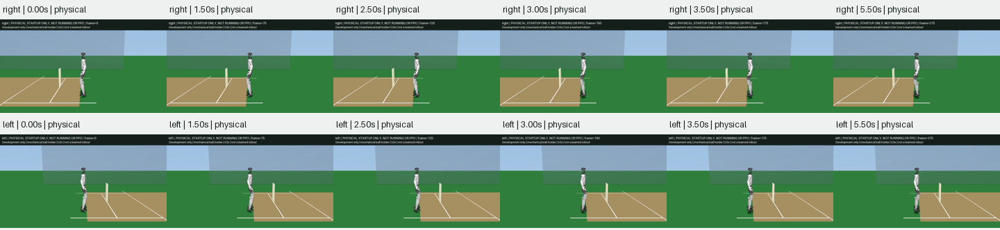
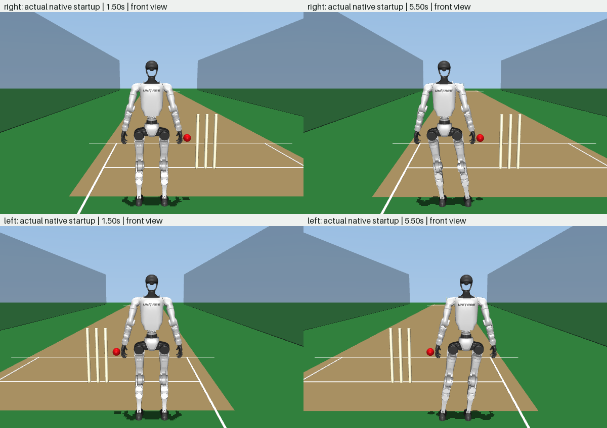

# Native Two-Foot Startup

**All four declared startup trials pass. Running bowling remains unfinished.**

This is a **startup-only test**, not a learned running delivery. The earlier
[moving-start reference](g1_cricket_ground_momentum.md#foreaft-pendulum-comparison)
falls before release. Its initial forward, lateral and downward velocity is
not a from-rest initialization, even when sampled support bounds pass.

## Protocol

Source `8699e0f683856b0fbf5795dc5f0c213bbcf713df` adds a separate held-ball
startup reference and native replay, without changing the existing running
controller defaults or trained actors:

- Start from the original neutral joint configuration, with both soles on
  the pitch, zero velocity and the ball aligned with its mechanical holder.
- Hold for 2 s, move the whole-system COM 80 mm toward the front foot over
  1.5 s using a quintic ramp, then hold for 2 s.
- Retarget the twelve leg joints and root translation offline. Both feet,
  neutral upper body and original robot geometry remain constrained.
- Compute static support-aware joint feedforward, including the held ball's
  gravitational load through the wrist Jacobian. Nonnegative vertical foot
  forces balance the six unactuated coordinates; the remaining joint torques
  become bounded position-command offsets.
- Execute 20 ms controls with original motor parameters, force caps and joint
  limits, the finite-compliance ball holder and native contact physics. No
  root support force, live pose writes, release or ball-velocity prescription.
- Evaluate both hands at 125 and 62.5 microseconds, retaining every episode
  and substep. Render both complete finer-resolution replays at 0.5x.

Static support is only a feedforward hypothesis. Actual contact loads and
motion, rather than the offline least-squares residual, determine whether
this bounded startup test passes. A 1 s final hold in an exploratory replay
had not yet settled below the declared speed threshold; the retained protocol
allows 2 s rather than relaxing that threshold.

The startup gate requires completion, pelvis height at least 0.48 m and up
component at least 0.95, original joint/motor limits, no unintended loaded
contacts, holder error at most 1 mm, foot displacement at most 5 mm and ball
penetration at most 6 mm. Initial/final half-second root linear/angular and
maximum joint speeds must stay below 0.02 in their respective SI units. Both
feet must remain loaded in the final window, mean vertical support must be
within 1% of system weight, front-foot share at least 75%, and measured COM
shift within 10 mm of the requested 80 mm.

## Results

All four 5.5 s episodes complete from rest, with no joint-stop excursion,
unintended loaded contact, release or ball penetration. The 264,000 native
substeps are retained. The table reports the finer 62.5-microsecond trials;
the evaluation includes both resolutions without selected-row filtering.

| Hand | COM shift | Front/back mean load in final window | Front share | Peak motor/cap | Peak foot displacement |
| --- | ---: | ---: | ---: | ---: | ---: |
| Right | 80.105 mm | 269.98 / 58.63 N | 82.158% | 0.2341 | 4.387 mm |
| Left | 80.019 mm | 269.78 / 58.83 N | 82.097% | 0.2339 | 4.303 mm |

System weight is 328.607 N. Final-window mean foot loads differ by less than
0.0016 N between physics timesteps. Peak holder force stays below 1.629 N and
holder positional error below 0.020 mm. Final-window root linear speed is
below 0.000186 m/s, root angular speed below 0.000252 rad/s and all joint
speeds below 0.000795 rad/s. Neither model parameters nor original limits
were enlarged to get these results.

All 95 focused running, reference-dynamics, tracking and bimanual tests pass
with warnings treated as errors; Ruff and diff checks pass. All 36 recorded
source fingerprints match the frozen implementation. The startup tests cover
held-ball equilibrium, both grounded soles, rest intervals, actual native
load transfer and unchanged masses, inertias, joint ranges and motor limits.

Offline foot error is at most 0.100 mm and COM target error 1.380 mm. These
IK tolerances are distinct from physical foot movement and the measured COM
shift above. The whole-body reference is not an executable motion proof by
itself; native replay supplies the evidence for this limited startup stage.





[Right-hand startup video](../g1_cricket_results/running_startup_v1/right.mp4) /
[left-hand startup video](../g1_cricket_results/running_startup_v1/left.mp4).
All 552 frames decode nonblank and both review sheets were inspected. These
videos show standing and load transfer only; they are not cricket highlights.

## Reproduce

In the documented UniLab environment, use a new output directory:

```sh
PYTHONPATH=src:scripts OMP_NUM_THREADS=2 python \
  scripts/evaluate_g1_cricket_startup.py \
  g1_cricket_results/running_startup_v1 --render
```

The [evaluation](../g1_cricket_results/running_startup_v1/evaluation.json)
records source hashes, simulator version, timing, all gate failures and
complete summary extrema. Compressed NPZs retain all sixteen substep fields,
every control-frame pose/velocity and both complete offline references.
Contacts/force sensors/kinematics refer to the solved beginning of each
physics substep; the timestamp, integrated position and velocity refer to
its end. These are simulated loads, not calibrated hardware tactile data.

## Remaining Work

The unloaded foot has not yet lifted. Forward acceleration, the transition
into actual strides, gather, overarm release, legal planting and recovery
remain unverified. Do not splice this prefix onto the failed running curve
and call it a successful delivery. The join needs continuous state and
achievable native support forces. No new PPO training, independent Menagerie
learning, complete cricket qualification or advertising video is claimed.
