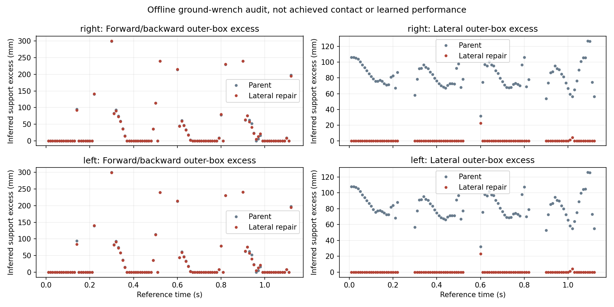
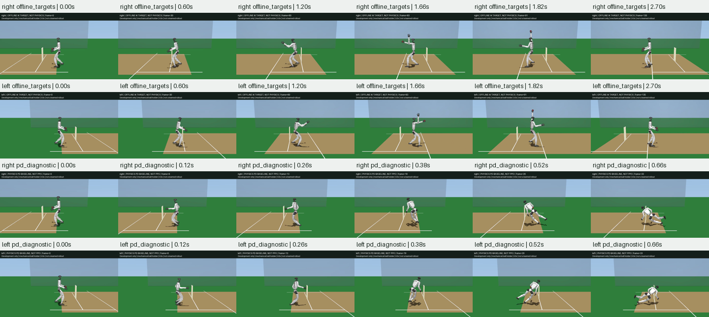

# Lateral Running Support

This experiment changes only the offline lateral center-of-mass (COM) target.
The earlier run-up keeps COM lateral position fixed while one foot supports
the robot, approximately 12 cm off the centerline. A support-wrench audit
checks whether that motion demands a ground-force location outside the foot.
These inferred forces are not measured contact telemetry or learned results.

## Results



Each hand retains 119 time samples at two derivative resolutions: 476 rows
per variant, without dropping flight or transition rows. At the finer
0.625 ms resolution, 91 samples per hand have an inferred vertical force
above 1 N and a foot within the 2 mm support tolerance. Seven straddle phase
boundaries, where derivative estimates blend the adjacent contact phases.

| Reference | Lateral outside, right/left | Forward/backward outside, right/left | Physical fall, right/left |
| --- | --- | --- | --- |
| Parent momentum reference | 91/91 of 91 | 32/32 of 91 | 0.68/0.68 s |
| Lateral support candidate | 3/3 of 91 | 33/33 of 91 | 0.66/0.66 s |

For the 84 non-boundary stance samples, lateral violations reduce from 84/84
to 2/2 per hand. Remaining interior lateral excess is 4.17/4.20 mm; with
boundary samples it is 22.46/22.99 mm. The forward/backward problem remains:
interior excess reaches 113.09 mm and boundary estimates reach approximately
300 mm. CoP refinement differences reach 4.97 mm, so this is a sampled
necessary-condition audit, not a converged continuous-contact certificate.
The parent is already laterally inconsistent before its first ankle failure;
fixing that component alone does not repair the entire reference/controller.

Both unassisted PD episodes fail before release, with maximum joint-limit
excess 0.08746/0.08772 rad and unwanted hand/hip/thigh contacts. No trained
policy or bowling success is claimed. Full reference poses still track feet
within 1.75 mm and arm segments within 5.46 mm, with no audited reference
intersections; five/right and four/left IK frames hit their evaluation limit.
These offline checks do not override the physical failures.



The [candidate evaluation](../g1_cricket_results/running_support_v1/evaluation.json),
[candidate support audit](../g1_cricket_results/running_support_v1/support_audit.json),
and [parent support audit](../g1_cricket_results/running_momentum_v1/support_audit.json)
retain complete results. All 340 MP4 frames decode nonblank, both review figures
were inspected, and all 33 reference input fingerprints match the frozen
generator `d514f634`. All 79 focused tests pass with warnings as errors; Ruff
passes. The next requirement is a stance angular-momentum/forward-support
trajectory consistent with the planted foot, not another unchanged PPO run
or a gain increase against an infeasible reference.

## Design

For a level ground plane, total force is `F = mass * (COM_acceleration - gravity)`.
The moment about the world origin is `H_dot + COM cross F`, where `H_dot` is
the whole-system centroidal angular-momentum derivative, including the held
ball. Required center of pressure (CoP) is `[-moment_y, moment_x] / F_z`.
The [centroidal ZMP derivation](https://scaron.info/robotics/zero-tilting-moment-point.html)
explains this necessary balance relation; being inside the foot does not
certify joint torques, friction, yaw moment or a feasible full-body motion.

`LateralSupportCOM` first neglects `H_dot_x` to construct a candidate:
`y_ddot = (gravity + z_ddot) * (y - support_y) / z`. It solves the linear
variable-height stance equation for a periodic alternating solution, with
0.22 s stance and 0.08 s ballistic flight per step. Lateral velocity is
continuous at takeoff and landing. The existing 1.20-1.32 s gather connects
position/velocity back to the parent COM trajectory. Forward and vertical COM,
foot targets, arm motion, release time and original robot limits are unchanged.
This is an offline reference, not a live root force or simulation pose write.

`audit_g1_cricket_running_support.py` then restores full angular-momentum
terms using MuJoCo and differentiates the fixed reference curve at two
resolutions. Every 10 ms run-up sample, including phase boundaries, remains
in the report. Feet within 2 mm of the pitch contribute to a conservative
axis-aligned projected support box. Leaving that outer box rejects planar
support at the sample; entering it is not a feasibility certificate.
Flight rows without appreciable vertical force have no defined CoP.

```sh
PYTHONPATH=src:scripts OMP_NUM_THREADS=2 uv run --no-project \
  --python ../unilab_submission_checkout/.venv/bin/python \
  python scripts/retarget_g1_cricket_running.py \
  g1_cricket_results/running_support_v1 --render \
  --ballistic-parent g1_cricket_results/running_front_raise_v1 \
  --lane-offset 0.2 --conserve-momentum --lateral-support
```

Then run `scripts/audit_g1_cricket_running_support.py` on each of
`g1_cricket_results/running_momentum_v1` and `g1_cricket_results/running_support_v1`.
Outputs must not already exist. Both complete physical PD episodes remain
required; reference improvements alone cannot qualify a bowling video.
